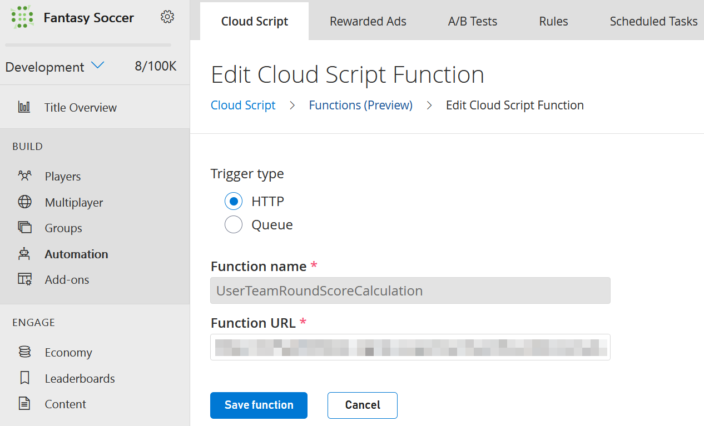
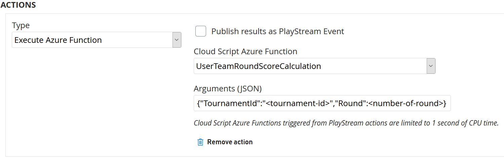
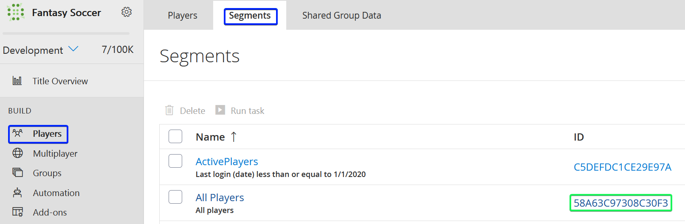
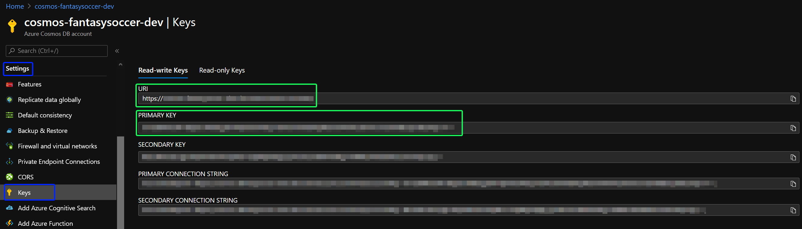

# Configuration and starting up

## Index

- [Summary](#summary)
- [Creation of external resources](#creation-of-external-resources)
- [Creation of a Function and scheduled task in PlayFab](#creation-of-a-function-and-scheduled-task-in-playfab)
- [Populate the data model](#populate-the-data-model)
- [Configure the web application](#configure-the-web-application)
- [Highlights](#highlights)
  - [Provisioning script and the Open ID Connection creation](#provisioning-script-and-the-open-id-connection-creation)

## Summary

This document will explain how to create the required resources and configure the solution to be executed.

## Creation of external resources

Fantasy Soccer uses external Azure and PlayFab resources.

First of all, create the below resources following these instructions:

- Create an Azure Active Directory Tenant ([link](https://docs.microsoft.com/azure/active-directory/fundamentals/active-directory-access-create-new-tenant))
- Create a PlayFab account ([link](https://docs.microsoft.com/gaming/playfab/gamemanager/quickstart#create-a-playfab-account))
- Create a PlayFab game ([link](https://docs.microsoft.com/gaming/playfab/gamemanager/quickstart#create-your-first-game))
- Create a PlayFab Title ([link](https://docs.microsoft.com/gaming/playfab/gamemanager/quickstart#your-studios-and-titles))
- Create a Catalog in PlayFab ([link](https://docs.microsoft.com/gaming/playfab/features/commerce/items/catalogs))
- Create a Store in PlayFab ([link](https://docs.microsoft.com/gaming/playfab/features/commerce/stores/quickstart#creating-a-store))
- Create a virtual currency in PlayFab ([link](https://docs.microsoft.com/gaming/playfab/features/commerce/economy/currencies))
  - Set the *Initial deposit* with the same value configured for `MaxBudget` in the [Constants file][constants-file].
  - *Recharge rate* and *Recharge maximum* must be set as **0**.

After that, execute the provisioning script which will create the next resources:

- Resource group
- App Service Plan
- Web App
- Storage account
- Function App
- Cosmos DB Account
- Containers

> **NOTE**: Executing the provisioning script might end up generating costs in Azure.

Besides that, the script creates the [OpenID connection][open-id-connection] in PlayFab that allows using Azure AD as the identity provider.

To know how to execute it refer to the [provisioning script document][provisioning-script-document].

## Creation of a function and scheduled task in PlayFab

Create a function called  `UserTeamRoundScoreCalculation` triggered by an HTTP request, which calls the [`UserTeamRoundScoreCalculation`][userteamroundscorecalculation-function] Azure Function. You can follow this [walk-through][how-to-create-a-cloudscript-azure-function] about how to create it.

---

<p align="center">
  
</p>

---

After that, you have to create the scheduled task to trigger the previous function. This task has to be scheduled manually with the following argument replacing the placeholders. These arguments set the tournament and round used to calculate and update the user team round score.

---

<p align="center">
  
</p>

---

You can get more information about how to create scheduled task [here][how-to-create-a-scheduled-task-in-playfab].

## Populate the data model

This repository includes a tool to populate the entities in Cosmos DB and PlayFab. To execute it refer to the [DataSeeder document][data-seeder-document].

## Configure the web application

The configuration of the web application - in the [`appsettings.json`][app-settings] - holds three sections, `AzureAD`, `PlayFab`, and `CosmosDB`.

```json
{
  "AzureAD": {
    "Instance": "https://login.microsoftonline.com/",
    "Domain": "<your-domain>",
    "ClientId": "<your-client-id>",
    "TenantId": "<your-tenant-id>",
    "CallbackPath": "/signin-oidc"
  },
  "PlayFab": {
      "TitleId": "<your-title-id>",
      "ConnectionId": "<connection-id>",
      "DeveloperSecretKey": "<developer-secret-key>",
      "CatalogName": "<catalog-name>",
      "StoreName": "<store-name>",
      "Currency": "<currency>",
      "AllUserSegmentId": "<AllUserSegmentId>"
  },
  "CosmosDB": {
      "EndpointUri": "<endpoint-uri>",
      "PrimaryKey": "<primary-key>",
  }
}

```

The `AzureAD` section consists of the settings used to use Azure AD as an identity provider. Hence, in order to complete this section, check the document about how to [Integrate PlayFab with Azure AD B2C as an Identity Management service][integrate-playfab-with-azure-ad].

To complete the `PlayFab` section use the data of the resources created in the previous step. For getting the `DeveloperSecretKey` follow this [tutorial][secret-key-management]. For the `AllUserSegmentId` you can use the `All Players` segment which is created by default with each title and you can retrieve it from the game manager.

---

<p align="center">
  
</p>

---

For the `CosmosDB` section you can retrieve the keys from the Azure portal, going to the Cosmos DB resource > `settings` > `keys`. There will be the `URI` - the `EndpointUri` in the [`appsettings`][app-settings] - and the `PRIMARY KEY`.

---

<p align="center">
  
</p>

---

After complete these settings, you can run the solution.

## Highlights

### Provisioning script and the Open ID Connection creation

This repository includes a provisioning script that is responsible for creating several resources, include among those the Open ID Connection (OIDC) in PlayFab. You can choose to create these resources manually, but you have to consider that the OIDC creation has to be done through the PlayFab API due to [these reasons][playfab-login-with-b2c-oidc-creation].

<!-- PlayFab references -->
[open-id-connection]: https://docs.microsoft.com/rest/api/playfab/admin/authentication/createopenidconnection?view=playfab-rest
[provisioning-script-document]: ./tools/provisioning-script/readme.md
[secret-key-management]: https://docs.microsoft.com/gaming/playfab/gamemanager/secret-key-management
[how-to-create-a-scheduled-task-in-playfab]: https://docs.microsoft.com/gaming/playfab/features/automation/scheduled-tasks/quickstart#step-2---create-a-scheduled-task
[how-to-create-a-cloudscript-azure-function]: https://docs.microsoft.com/gaming/playfab/features/automation/cloudscript-af/quickstart#create-an-azure-function

<!-- Code references -->
[app-settings]: ./FantasySoccer/FantasySoccer/appsettings.json
[userteamroundscorecalculation-function]: ./FantasySoccer/FantasySoccer.Functions/UserTeamRoundScoreCalculation.cs
[constants-file]: ./FantasySoccer/FantasySoccer.Core/Configuration/FantasySoccerConstants.cs#L7

<!-- Self references -->
[integrate-playfab-with-azure-ad]: ../playfab-login-with-b2c/README.md
[playfab-login-with-b2c-oidc-creation]: ../playfab-login-with-b2c/README.md#open-id-connection-creation
[data-seeder-document]: ./dataseeder.md
