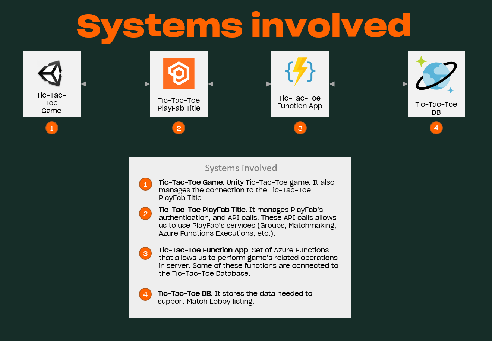
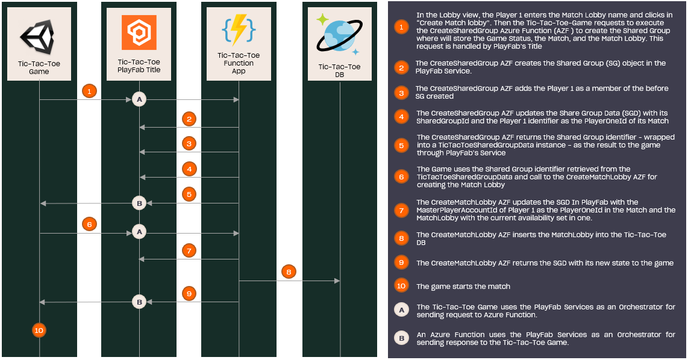

# Create a Match Lobby

## Index

- [Summary][summary]
- [Prerequisites][prerequisites]
- [Create Match Lobby Feature][create-match-lobby-feature]
  - [Architecture][architecture]
  - [Implementation][implementation]
    - [Unity Game: Starts the creation process][unity-game-starts-the-creation-process]
    - [PlayFab Title: Integration with Azure Functions][playfab-title-integration-with-azure-functions]
    - [Azure Function App: CreateSharedGroup function][azure-function-app-create-shared-group-function]
    - [Azure Function App: CreateMatchLobby function][azure-function-app-creatematchlobby-function]

## Summary

This sample demonstrates how to implement the Match Lobbies feature. A Match Lobby is an entity that allows a set of players to be matched and to play together.

This implementation uses the [Shared Group Data][shared-group-data] feature, a data entity shared between a small group of players, where the game state and players' data will be stored during the match.

The Match Lobby data is also stored in a Cosmos DB instance, allowing players to list and join to any available lobby.

## Prerequisites

Before configuring this project, first ensure the following prerequisites have been completed:

- Read and complete the [PlayFab configuration][playfab-config-readme].
- Read and complete the [Azure Function configuration][azure-function-config-readme].
- Read and complete the [Cosmos DB configuration][cosmos-db-config-readme].
- Read the [Search Match Lobby][search-match-lobby-readme] implementation guide.

## Architecture

This is the current Architecture we're using for implementing the Match Lobby feature:

---

---

## Implementation

The implementation of the Match Lobby creation feature has the following steps:

---

---

### Unity Game: Starts the creation process

The Unity Game is the first layer involved. Here is where the Match Lobby creation process starts with the player interaction, which triggers the execution of the [`CreateSharedGroup`][create-shared-group-data] Azure Function.

The requests to the [`CreateSharedGroup`][create-shared-group-data] are sent from the [`SharedGroupDataHandler`][shared-group-handler] which uses the `ExecuteFunction` method from the [PlayFab SDK][playfab-sdk].

The same logic is [used](./TicTacToe/Assets/Scripts/Handlers/MatchlobbyHandler.cs#L47) to call the `CreateMatchLobby` function.

### PlayFab Title: Integration with Azure Functions

PlayFab allows the integration with Azure Functions working as an intermediary between the Unity game and the Azure Function.

In this sample, PlayFab receives the requests to execute the Azure Functions with the names `CreateSharedGroup` and `CreateMatchLobby`.

### Azure Function App: CreateSharedGroup function

The [CreateSharedGroup][create-shared-group-data] function creates the Shared Group Data (SGD) where the game data will be stored, with the [`TicTacToeSharedGroupData`][tictactoe-shared-group-data] model structure:

- The Game Status: It contains the status of the board at each movement, the current player, and the winner.
- The Match: It contains the Identifier of the P1, and P2.
- The Match Lobby: It contains the `MatchLobbyId`, that works also as its name, and the current availability.

This function is responsible for:

- Creates the Shared Group Data in PlayFab
- Adds the player who has triggered the function as a member of the group
- Updates the SGD's `SharedGroupId` and `Match` attributes. The `SharedGroupId` is updated with the `ID` return by PlayFab in the SGD creation, meanwhile the `Match` is updated in its `PlayerOnId` attribute with the `ID` of the player who has triggered the function.

### Azure Function App: CreateMatchLobby function

The Azure Function [`CreateMatchLobby`][create-match-lobby] is responsible for updating the Shared Group Data with the Match Lobby and storing it in Cosmos DB.

We perform this update with a request to the [UpdateSharedGroupData][ms-updatesharedgroupdata-doc] endpoint specifying the `SharedGroupId` and the Match Lobby's data to update.

Finally, the [`TicTacToeSharedGroupData`][tictactoe-shared-group-data] is returned to the Game which starts the [Start Match][start-match-readme] process.

<!-- Index Links -->
[summary]: #summary
[prerequisites]: #prerequisites
[create-match-lobby-feature]: #create-match-lobby-feature
[architecture]: #architecture
[implementation]: #implementation

<!-- Auto reference -->
[playfab-title-integration-with-azure-functions]: #playfab-title-integration-with-azure-functions
[unity-game-starts-the-creation-process]: #unity-game-starts-the-creation-process
[azure-function-app-create-shared-group-function]: #azure-function-app-createsharedgroup-function
[unity-game-calls-to-the-creatematchlobby-function]: #unity-game-calls-to-the-creatematchlobby-function
[azure-function-app-creatematchlobby-function]: #azure-function-app-creatematchlobby-function

<!-- READMEs -->
[search-match-lobby-readme]: ./search-match-lobby.md
[playfab-config-readme]: ./TicTacToe/README.md
[azure-function-config-readme]: ./AzureFunctions/README.md
[cosmos-db-config-readme]: ./AzureFunctions/cosmos-db-configuration.md
[start-match-readme]: ./start-match.md

<!-- AZURE FUNCTIONS -->
[create-shared-group-data]: ./AzureFunctions/TicTacToeFunctions/Functions/CreateSharedGroup.cs
[tictactoe-shared-group-data]: ./AzureFunctions/TicTacToeFunctions/Models/TicTacToeSharedGroupData.cs
[create-match-lobby]: ./AzureFunctions/TicTacToeFunctions/Functions/CreateMatchLobby.cs

<!-- Game -->
[start-match-method]: ./TicTacToe/Assets/Scripts/Lobby.cs#L219
[shared-group-handler]: ./TicTacToe/Assets/Scripts/Handlers/SharedGroupHandler.cs#L16

<!-- PlayFab References -->
[shared-group-data]: https://docs.microsoft.com/gaming/playfab/features/social/groups/using-shared-group-data
[playfab-sdk]: https://github.com/PlayFab/CSharpSDK
