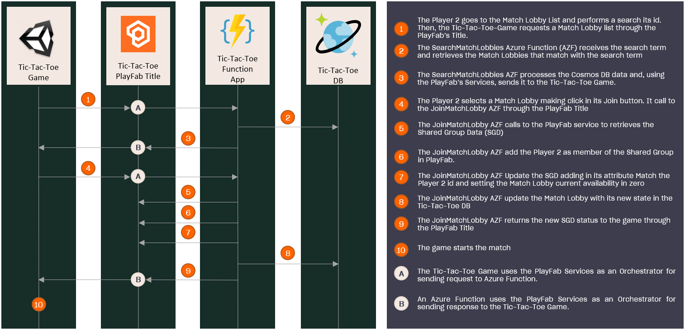

# Join to the Match Lobby

## Index

- [Summary][summary]
- [Prerequisites][prerequisites]
- [Architecture][architecture]
- [Implementation][implementation]
  - [Unity Game: Starts the connection process][unity-game-starts-the-connection-process]
  - [Azure Function App: JoinMatchLobby function][azure-function-app-joinmatchlobby-function]

## Summary

This sample demonstrates how to implement the Join Match Lobby feature. It allows a player to connect to an existing Match Lobby in order to play against another player.

## Prerequisites

Before configuring this project, first ensure the following prerequisites have been completed:

- Read and complete the [PlayFab configuration][playfab-config-readme].
- Read and complete the [Azure Function configuration][azure-function-config-readme].
- Read and complete the [Cosmos DB configuration][cosmos-db-config-readme].
- Read the [Search Match Lobby][search-match-lobby-readme] implementation guide.

## Architecture

Before starting explaining how this feature works, lets see how the game was implemented:

---

---

## Implementation

The implementation of the Match Lobby creation feature consists of the following steps:

---

---

### Unity Game: Starts the connection process

The Unity Game is the first layer involved, once the game has [retrieved the Lobbies list][search-match-lobby-readme] the player clicks the `Join` button of the desired Match Lobby.

---

  

---

This button executes the [`JoinMatchLobby`][match-lobby-handler] method of the `MatchLobbyHandler` that triggers the [`JoinMatchLobby`][join-match-lobby] Azure Function using the [PlayFab SDK][playfab-sdk].

### Azure Function App: JoinMatchLobby function

The Azure Function [`JoinMatchLobby`][join-match-lobby] is responsible for:

- [Retrieving][retrieving-the-shared-group-data] the Shared Group Data by its identifier.
- [Adding][add-member-to-shared-group-data] the P2 as member of the shared group.
- [Updating][update-the-shared-group-data] the Shared Group Data:
  - Updates the current availability of  the `MatchLobby` property to zero.
  - Sets the current player ID as the `PlayerTwoId` of the `Match` property.
- [Updating][insert-match-lobby-into-cosmos-db] the new `MatchLobby` in Cosmos DB.

To add P2 as a member of the Shared Group the [function sends a request][add-member-to-shared-group-data] to the [`/Server/AddSharedGroupMembers`][add-shared-group-members-endpoint] endpoint through the PlayFab's SDK.

> NOTE: The function must use the `MasterPlayerAccountId` - which is [retrieved from its context][retrieve-the-master-player-account-id-from-the-function-context] - as P2 identifier.

To update the Shared Group Data the [function sends a request][update-the-shared-group-data] to the [`/Server/UpdateSharedGroupData`][update-shared-group-data-endpoint] endpoint through the PlayFab's SDK.

Next, the current availability of the `MatchLobby` is decreased and its new state is [updated in Cosmos DB][insert-match-lobby-into-cosmos-db].

Finally, the Shared Group Data is returned to the Game which starts the [Start Match][start-match-readme] process.

> NOTE: As this function might be called by more than one players that want to join to the same Match Lobby at the same time, we've implemented a solution for avoiding that this race-condition context causes problems in the game-play. The solution is implemented [here][match-lobby-util-race-condition-fix], where we first try to update the Cosmos DB related document, and for ensuring that only one of those possible changes apply, we base our update on the *etag* property of the document. This *etag* works as a Document version control, and it will be checked before doing the update. So, if its value has been updated in the time between after we retrieve the Document and the time before we update it, we won't be able to perform the update as the *etag* was updated by other Player, and this will grant that only one of those possible changes happens.

<!-- Index Links -->
[summary]: #summary
[prerequisites]: #prerequisites
[architecture]: #architecture
[implementation]: #implementation
[unity-game-starts-the-connection-process]: #unity-game-starts-the-connection-process
[azure-function-app-joinmatchlobby-function]: #azure-function-app-joinmatchlobby-function

<!-- READMEs -->
[search-match-lobby-readme]: ./search-match-lobby.md
[playfab-config-readme]: ./TicTacToe/README.md
[azure-function-config-readme]: ./AzureFunctions/README.md
[cosmos-db-config-readme]: ./AzureFunctions/cosmos-db-configuration.md
[start-match-readme]: ./start-match.md

<!-- AZURE FUNCTIONS -->
[join-match-lobby]: ./AzureFunctions/TicTacToeFunctions/Functions/Service/JoinMatchLobby.cs
[retrieving-the-shared-group-data]: ./AzureFunctions/TicTacToeFunctions/Util/SharedGroupDataUtil.cs#L66
[add-member-to-shared-group-data]: ./AzureFunctions/TicTacToeFunctions/Util/SharedGroupDataUtil.cs#L28
[update-the-shared-group-data]: ./AzureFunctions/TicTacToeFunctions/Util/SharedGroupDataUtil.cs#L41
[insert-match-lobby-into-cosmos-db]: ./AzureFunctions/TicTacToeFunctions/Util/MatchlobbyUtil.cs#L34
[retrieve-the-master-player-account-id-from-the-function-context]: ./AzureFunctions/TicTacToeFunctions/Functions/Service/JoinMatchLobby.cs#L28
[match-lobby-util-race-condition-fix]: ./AzureFunctions/TicTacToeFunctions/Util/MatchlobbyUtil.cs#L75

<!-- Game -->
[match-lobby-handler]: ./TicTacToe/Assets/Scripts/Handlers/MatchlobbyHandler.cs#L21

<!-- PlayFab References -->
[playfab-sdk]: https://github.com/PlayFab/CSharpSDK
[add-shared-group-members-endpoint]: https://docs.microsoft.com/rest/api/playfab/server/shared-group-data/addsharedgroupmembers?view=playfab-rest
[update-shared-group-data-endpoint]: https://docs.microsoft.com/rest/api/playfab/server/shared-group-data/updatesharedgroupdata?view=playfab-rest
