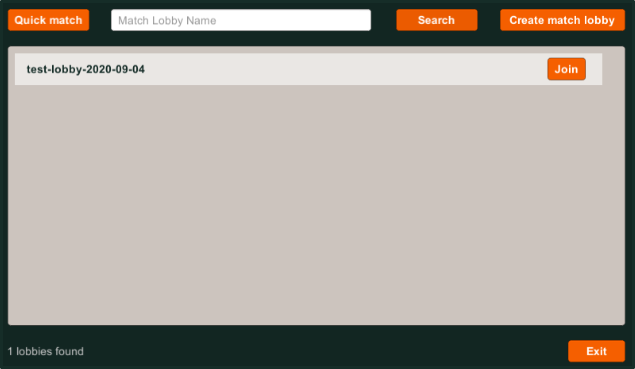

# Search Match Lobby

## Index

- [Summary][summary-section]
- [Prerequisites][prerequisites-section]
- [Search Match Lobby][search-match-lobby]
  - [Architecture][feature-architecture-section]
  - [Implementation][feature-implementation-section]
    - [Unity Game: Starts the connection process][unity-game-starts-the-connection-process]
    - [PlayFab Title: Integration with Azure Functions][playfab-title-integration-with-azure-functions]
    - [Azure Function App: SearchMatchLobbies Function][azure-function-app-searchmatchlobbies-function]

## Summary

This document explains how the Search Match Lobby feature was implemented.

This feature allows players to look for a specific Match Lobby, to which they'll be connecting for playing against another known player. We can filter these lobbies by their *IDs* or their *Names*.

## Prerequisites

Before configuring this project, first ensure the following prerequisites have been completed:

- Read and complete the [PlayFab configuration][playfab-config-readme].
- Read and complete the [Azure Function configuration][azure-function-config-readme].
- Read and complete the [Cosmos DB configuration][cosmos-db-config-readme].

## Architecture

Before starting explaining how this feature works, lets see how the game was implemented.

---

![alt-text][architecture-01]

---

Regarding the **Search Match Lobby** feature, we can add the next information:

- [Tic-Tac-Toe game][unity-game-project].
  - Here we have the Search option where we can look Match Lobbies by their IDs or their names:

  ---

   <p align="center">
     
   </p>

  ---

- [Tic-Tac-Toe Function App][azure-function-project].
  - In this project we've the [Search Match Lobbies][azure-function-search-match-lobbies] Azure Function that allows us to perform the Match Lobby search.

## Implementation

The *Search Match Lobby* flow consists of six different steps:

---

![alt-text][search-match-lobby-diagram-01]

---

### Unity Game: Starts the connection process

The *Search Match Lobby* process starts when a player enters a Match Lobby filter (*ID* or *Name*) for finding a specific Match Lobby for playing against another player.

---

   <p align="center">
     
   </p>

---

For performing the search, we are running the [GetMatchLobbyList][match-lobby-handler-get-lobby-list] method from the [MatchLobbyHandler][match-lobby-handler] class:

```CSharp
public IEnumerator GetMatchLobbyList(string filter = "")
{
    var request = new ExecuteFunctionRequest
    {
        FunctionName = "SearchMatchLobbies",
        FunctionParameter = new SearchMatchLobbiesRequest
        {
            SearchTerm = filter
        },
        AuthenticationContext = new PlayFabAuthenticationContext
        {
           EntityToken = Player.EntityToken
        }
    };

    PlayFabCloudScriptAPI.ExecuteFunction(request,
        (result) => {
            // Process result here.
        },
        (error) => {
            // Process error here.
        }
    );
}
```

This method uses the PlayFab's CloudScript API for doing a request to an specific Azure Function (which implementation we'll explain later). The method receives the filter the player has input. With this data, we create an instance of the [SearchMatchLobbiesRequest][search-match-lobbies-request] class, which has the format that the [SearchMatchLobbies][azure-function-search-match-lobbies] Azure Function requires.

With all these classes we instantiate a new [ExecuteFunctionRequest][creating-instance-execute-function-request] object, which has the required format for executing the specified Azure Function through the PlayFab service. For sending this request, we call the `ExecuteFunction` method from the `PlayFabCloudScriptAPI` class from the [PlayFab SDK][unity-playfab-csharp-sdk] (see this document for further information on the [Execute Function API method][playfab-cloudscript-api-doc-execute-function]).

### PlayFab Title: Integration with Azure Functions

With the changes we mentioned in the previous step we're using the PlayFab CloudScript feature for Azure Functions, which in short terms allows us to call ours own Azure Functions through the CloudScript service. You can find more information in [this document][playfab-cloudscript-azure-function-feature], and in [this tutorial][playfab-cloudscript-azure-function-tutorial].

For doing the related configuration, we recommend you to read and complete [this guide][playfab-config-readme].

### Azure Function App: SearchMatchLobbies Function

> NOTE: For this step, we also recommend to read and complete the [Azure Function configuration][azure-function-config-readme].

The next step of the Search Match Lobby process starts with the Execution of the [Search Match Lobbies][azure-function-search-match-lobbies] Azure Function.

```CSharp
[FunctionName("SearchMatchLobbies")]
public static async Task<Wrapper<MatchLobbyInfo>> Run(
    [HttpTrigger(AuthorizationLevel.Function, "post", Route = null)] HttpRequestMessage req,
    [CosmosDB(ConnectionStringSetting = "PlayFabTicTacToeCosmosDB")] DocumentClient cosmosDBClient
)
{
    var context = await FunctionContext<SearchMatchLobbiesRequest>.Create(req);
    var lobbyListRequest = context.FunctionArgument;

    var result = // execute Cosmos DB Query here.

    return result;
}
```

This is an [HTTP triggered][azure-function-http-trigger-doc] function, which has a [Cosmos DB input binding][azure-function-cosmos-db-input-doc], from which we can retrieve a Match Lobby list.

From the input binding we retrieve a [SearchMatchLobbiesRequest][search-match-lobbies-request-azf] object (which has the search filters). Something important to highlight is that we parse the received request using the `Create` method from the `FunctionContext` class. This returns an object which contains the request data in the `FunctionArgument` property.

Then, we perform a request call to our Cosmos DB in [this line][azure-function-search-match-lobbies-cosmos-query] for getting the required data. This data will be returned to the Unity Game (through the PlayFab's service) for listing it in the Match Lobby search page. This is performed in [this line][azure-function-search-match-lobbies-return-data].

Finally, the Tic-Tac-Toe unity game receives the data from our Azure Function (check [it here][match-lobby-handler-get-lobby-list-success]), process it, and renders a list for the Match Lobbies found:

---

   <p align="center">
     
   </p>

---

<!-- Index -->
[summary-section]: #summary
[prerequisites-section]: #prerequisites
[search-match-lobby]: #search-match-lobby-feature
[feature-architecture-section]: #architecture
[feature-implementation-section]: #implementation
[unity-game-starts-the-connection-process]: #unity-game-starts-the-connection-process
[playfab-title-integration-with-azure-functions]: #playfab-title-integration-with-azure-functions
[azure-function-app-searchmatchlobbies-function]: #azure-function-app-searchmatchlobbies-function

<!-- Internal Links -->
[architecture-01]: ./document-assets/high-level-architecture.png
[search-match-lobby-diagram-01]: ./document-assets/images/diagrams/search-match-lobby-diagram-01.png

[unity-game-project]: ./TicTacToe
[azure-function-project]: ./AzureFunctions
[azure-function-search-match-lobbies]: ./AzureFunctions/TicTacToeFunctions/Functions/SearchMatchlobbies.cs
[azure-function-search-match-lobbies-return-data]: ./AzureFunctions/TicTacToeFunctions/Functions/SearchMatchlobbies.cs#L31s
[search-match-lobbies-request-azf]: ./AzureFunctions/TicTacToeFunctions/Models/Requests/SearchMatchLobbiesRequest.cs

[search-match-lobbies-request]: ./TicTacToe/Assets/Scripts/Models/Requests/SearchMatchLobbiesRequest.cs
[azure-function-search-match-lobbies-cosmos-query]: ./AzureFunctions/TicTacToeFunctions/Functions/SearchMatchlobbies.cs#L27

[match-lobby-handler]: ./TicTacToe/Assets/Scripts/Handlers/MatchlobbyHandler.cs
[match-lobby-handler-get-lobby-list]: ./TicTacToe/Assets/Scripts/Handlers/MatchlobbyHandler.cs#L71
[match-lobby-handler-get-lobby-list-success]: ./TicTacToe/Assets/Scripts/Handlers/MatchlobbyHandler.cs#L82

<!-- External links -->
[unity-playfab-csharp-sdk]: https://docs.microsoft.com/gaming/playfab/sdks/unity3d/
[unity-playfab-sdk-repo]: https://github.com/PlayFab/UnitySDK

[creating-instance-execute-function-request]: ./TicTacToe/Assets/Scripts/Handlers/RequestHandler.cs#L35

[playfab-cloudscript-api-doc]: https://docs.microsoft.com/rest/api/playfab/cloudscript/server-side-cloud-script?view=playfab-rest
[playfab-cloudscript-api-doc-execute-function]: https://docs.microsoft.com/rest/api/playfab/cloudscript/server-side-cloud-script/executefunction?view=playfab-rest

[playfab-cloudscript-azure-function-feature]: https://docs.microsoft.com/gaming/playfab/features/automation/cloudscript-af/
[playfab-cloudscript-azure-function-tutorial]: https://docs.microsoft.com/gaming/playfab/features/automation/cloudscript-af/quickstart#using-and-calling-cloudscript-using-azure-functions-from-your-playfab-title

[playfab-config-readme]: ./TicTacToe/README.md
[azure-function-config-readme]: ./AzureFunctions/README.md
[cosmos-db-config-readme]: ./AzureFunctions/cosmos-db-configuration.md

[azure-function-http-trigger-doc]: https://docs.microsoft.com/azure/azure-functions/functions-bindings-http-webhook-trigger?tabs=csharp
[azure-function-cosmos-db-input-doc]: https://docs.microsoft.com/azure/azure-functions/functions-bindings-cosmosdb-v2-input?tabs=csharp
