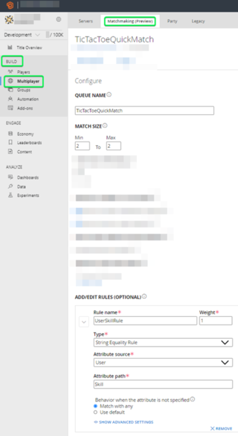
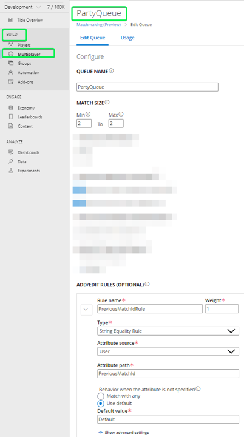

# PlayFab Configuration

## Index

* [Description][description-section]
* [Configuration][configuration-section]
  * [Pre-Requisites][pre-requisites-section]
  * [Configuration Steps][configuration-steps-section]
    * [PlayFab settings][playfab-settings-section]
    * [Unity Project settings][unity-project-settings-section]

## Description

This project consists in an [Unity][unity-main-page] Tic-Tac-Toe game with multiplayer support.

## Configuration

### Pre-requisites

Before configuring this project, first ensure you have completed the next pre-requisites:

* Clone this project in your computer (`git clone https://github.com/southworks/playfab.git`).
* Download and install *Unity Hub* and *Unity* IDE ([link][unity-hub-download]).
* Download the [PlayFab Unity Editor Extension Asset Package][playfab-sdk-download]
    
    > NOTE: save the *.unitypackage* file in an accessible folder, as we'll be using it later
* Read and complete the [Azure Function configuration][azure-function-readme].

### Configuration steps

#### PlayFab settings

The next steps will guide you for doing the [PlayFab][playfab-main-page] configuration:

1. Create a [PlayFab account][playfab-account-create] ([tutorial][playfab-account-create-tutorial]), or [sing-in][playfab-account-login] into your current account.
1. Create a new [PlayFab Title][playfab-title-create-tutorial] in your [PlayFab account][playfab-account-login].
1. Create a [Matchmaking queue][playfab-matchmaking-terminology] in your *PlayFab Title* for the *QuickMatch* feature:
    1. Open your Title and go to `Build/Multiplayer/Matchmaking`.
    1. Press the `New Queue` button.
    1. In the Creation page, enter the following:
        1. ***Queue Name***: `TicTacToeQuickMatch`.
        1. ***Match Size***: `Min = 2`; `Max = 2`.
        1. ***Rules***:
            1. ***Rule Name***: `UserSkillRule`.
            1. ***Weight***: `1`.
            1. ***Type***: select the `String Equality Rule` option.
            1. ***Attribute Source***: select the `User` option.
            1. ***Attribute path***: `Skill`.
            1. ***Behavior when the attribute is not specified***: select the `Match with any` option.
    1. At the end, you'll have something like this: 

    ---
    
    

      
    

    ---
1. Create a [Matchmaking queue][playfab-matchmaking-terminology] in your *PlayFab Title* for the *QuickMatch* feature:
    1. Open your Title and go to `Build/Multiplayer/Matchmaking`.
    1. Press the `New Queue` button.
    1. In the Creation page, enter the following:
        1. ***Queue Name***: `PartyQueue`.
        1. ***Match Size***: `Min = 2`; `Max = 2`.
        1. ***Rules***:
            1. ***Rule Name***: `PreviousMatchIdRule`.
            1. ***Weight***: `1`.
            1. ***Type***: select the `String Equality Rule` option.
            1. ***Attribute Source***: select the `User` option.
            1. ***Attribute path***: `PreviousMatchId`.
            1. ***Behavior when the attribute is not specified***: select the `Use default` option.
                1. ***Default value***: type `Default`.
    1. At the end, you'll have something like this: 

    ---
    
    

      
    

    ---
1. Configure the project's [Azure Functions][azure-function-readme-function-list]:
    1. Open your Title and go to `Build/Automation/CloudScript/Functions`.
    1. Do the following steps for each [Azure Functions][azure-function-readme-function-list] you use in this project:
        1. Press the `Register Function` button.
        1. Select the `HTTP` *Trigger Type* option.
        1. Enter your `Function name`.
        1. Enter your `Function URL` 
        > NOTE: you can follow [this tutorial][azure-function-readme-get-url] to get the *Function's URL*
        
        5. Press the `Register Function` button for saving the new function.

#### Unity Project settings

1. Install the [PlayFab Unity Package][playfab-sdk-download]:
    1. Open the *Tic-Tac-Toe* Unity Project.
    1. Navigate to the folder where you have saved the *PlayFab Unity Package* (it's the *.unitypackage* file).
    1. Double-click the *PlayFab Unity Package*.
    1. The next prompt will be shown:

    ---
    
    

      
    

    
    ---

    5. Press the ***Import*** button to import these assets into the project.
1. Configure the Unity project:
    1. First, go to your [PlayFab's Title][playfab-account-login] and retrieve your [PlayFab's title ID][playfab-title-get-title-id].
    1. Paste the *Title ID* in [this line][unity-constants-file-title-id] of the [Constants.cs][unity-constants-file] file.
1. Now, you're able to run the project.

<!-- Index -->
[description-section]: #description
[configuration-section]: #configuration
[pre-requisites-section]: #pre-requisites
[configuration-steps-section]: #configuration-steps
[playfab-settings-section]: #playfab-settings
[unity-project-settings-section]: #unity-project-settings

<!-- External links -->
[playfab-main-page]: https://playfab.com/
[playfab-account-create]: https://developer.playfab.com/en-US/sign-up
[playfab-account-create-tutorial]: https://docs.microsoft.com/gaming/playfab/gamemanager/pfab-account
[playfab-account-login]: https://developer.playfab.com/en-US/login
[playfab-title-create-tutorial]: https://docs.microsoft.com/gaming/playfab/gamemanager/quickstart#create-your-first-game
[playfab-title-get-title-id]: https://docs.microsoft.com/gaming/playfab/personas/developer#retrieving-your-titleid
[playfab-title-get-developer-secret-key]: https://docs.microsoft.com/gaming/playfab/gamemanager/secret-key-management
[playfab-unity-editor-extension-download]: https://github.com/PlayFab/UnityEditorExtensions/raw/master/Packages/PlayFabEditorExtensions.unitypackage
[playfab-matchmaking-terminology]: https://docs.microsoft.com/gaming/playfab/features/multiplayer/matchmaking/#terminology
[playfab-sdk-download]: https://aka.ms/playfabunitysdkdownload
[unity-main-page]: https://unity.com/
[unity-hub-download]: https://store.unity.com/?_ga=2.78991188.1980374127.1594748239-1650672176.1594748239#plans-individual

<!-- Internal Links -->
[azure-function-project]: ../AzureFunctions/TicTacToeFunctions/Functions
[azure-function-readme]: ../AzureFunctions/README.md
[azure-function-readme-get-url]: ../AzureFunctions/README.md#retrieve-azure-functions-urls
[azure-function-readme-function-list]: ../AzureFunctions/README.md#azure-function-list

[matchmaking-queue-02]: ../document-assets/images/matchmaking-queue-02.png "Matchmaking queue - TicTacToeQuickMatch."

[unity-constants-file]: ./Assets/Scripts/Helpers/Constants.cs
[unity-constants-file-title-id]: ./Assets/Scripts/Helpers/Constants.cs#L7
