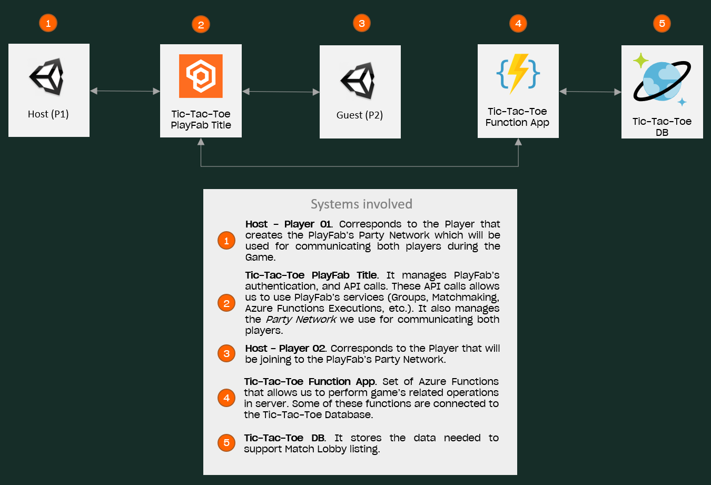
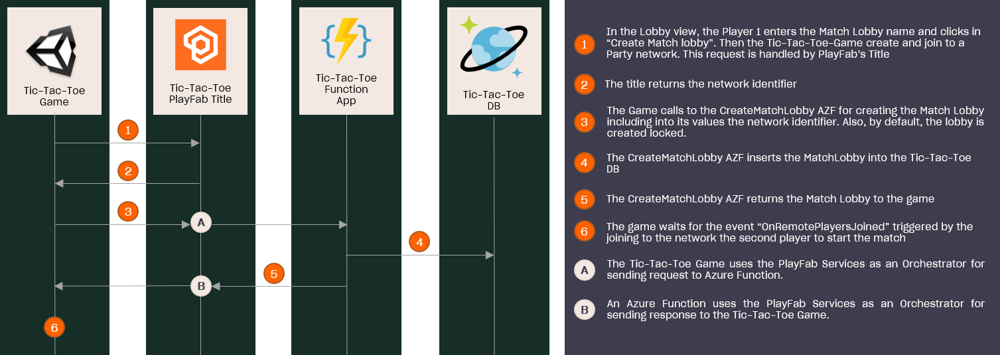

# Create a Match Lobby

## Index

- [Summary][summary]
- [Pre-requisites][prerequisites]
- [Create Match Lobby Feature][create-match-lobby-feature]
  - [Systems involved][systems-involved]
  - [Implementation][implementation]
    - [Unity Game: Starts the creation process][unity-game-starts-the-creation-process]
    - [PlayFab Title: Integration with Azure Functions][playfab-title-integration-with-azure-functions]
    - [Azure Function App: CreateMatchLobby function][azure-function-app-creatematchlobby-function]

## Summary

This sample demonstrates how to implement the match lobbies feature. A match lobby is an entity that allows a set of players to be matched and to play together.

The match lobby data is stored in a Cosmos DB instance, allowing players to list and join any available lobby. It includes the identifier of the Party network to which the players will join to, and across which players will share the game data.

Besides, this sample implements the lobby locking feature. This allows the host to lock the match lobby, generating an invitation code that the guest will need to use when they try to join. To do this, the match lobby stored in Cosmos DB includes the `Locked` attribute. The invitation code - named as [`invitation id`][pf-validation-id] by PlayFab - is included inside the network ID during the network creation by the Party SDK.

For more information about this feature see the [join document][join-to-the-match-lobby].

## Pre-requisites

- Read and complete the [PlayFab configuration][playfab-config-readme].
- Read and complete the [Azure Function configuration][azure-function-config-readme].
- Read and complete the [Cosmos DB configuration][cosmos-db-config-readme].
- Read the [Search Match Lobby][search-match-lobby-readme] implementation guide.

## Systems involved

This is the current Architecture we're using for implementing the match lobby feature:

---

---

## Implementation

The implementation of the match lobby creation feature has the following steps:

---

---

### Unity Game: Starts the creation process

The Unity Game is the first layer involved. The first step is creating the Party network, making the game [execute][lobby-create-group-create-and-join-to-network] the [`CreateAndJoinToNetwork`][pnh-create-and-join-to-network] method from the [`PartyNetworkHandler`][pnh], which waits for the network identifier returned by the PlayFab title. This [network identifier includes][pf-network-identifier-composition] the `invitation id`, which we use as the invitation code to join a locked lobby, concatenated with the network descriptor.

Once the game has retrieved the network identifier executes the `CreateMatchLobby` Azure Function, through the usage of PlayFab services. It is made [using][lobby-create-group-create-match-lobby] the [`CreateMatchLobby`][mlh-create-match-lobby] method from the [`MatchLobbyHandler`][mlh]. Internally, the `MatchLobbyHandler` uses the `PlayFabCloudScriptAPI.ExecuteFunction` from PlayFab SDK.

> NOTE: To be able of creating a Party network the PlayFab title must have enabled the use of Party. [Here][pf-enable-party] is a guide about how do it.

### PlayFab Title: Integration with Azure Functions

PlayFab allows the integration with Azure Functions working as an intermediary between the Unity game and the Azure Function.

In this sample, PlayFab receives the request to execute the Azure Function with the name `CreateMatchLobby`.

### Azure Function App: CreateMatchLobby function

The Azure Function [`CreateMatchLobby`][create-match-lobby] is responsible for creating the match lobby and storing it in the Cosmos DB.

This function receives as arguments the match lobby name, network id, and the locked state. Besides, it [extracts from the request context][create-match-lobby-extract-creator-id] the identifier of the player who has called the function to uses as the match lobby creator identifier.

> NOTE: By default, the game always creates the lobby as locked.

With this data, plus the `CurrentAvailability` set in 1, an instance of [`MatchLobby`][azf-match-lobby-class] class [is created][mlu-create-match-lobby] and inserted into the Cosmos DB.

Finally, the `MatchLobby` is returned to the game which [waits][lobby-catch-onremoteplayerjoined-event] for the event [`OnRemotePlayersJoined`][pf-onremoteplayerjoined-event], that is triggered when the second player joins the match lobby network. In order that, the guest has to know the network identifier which is retrieved from the `JoinMatchLobby` function, sending the lobby id and the invitation code if the lobby is locked. For more details you can see [join document][join-to-the-match-lobby].

At that moment, the host game instance catches the `OnRemotePlayersJoined` event and [sends][lobby-catch-onremoteplayerjoined-event-send-message] a `Players Ready` message, which will trigger the [set][lobby-set-startmatch-at-players-ready-event] of `ApplicationModel.StartMatch` property in `true` in the guest game instance. Furthermore, it also [set the same property][lobby-catch-onremoteplayerjoined-event-set-startmatch] with the same value in the host game.

This property will be evaluated in the next [`Update`][unity-event-update] Unity event execution in both host and guest instances of the game, and execute the [`StartMatch`][lobby-start-match] method which will load the game scene.

<!-- Index Links -->

[summary]: #summary
[prerequisites]: #pre-requisites
[create-match-lobby-feature]: #create-match-lobby-feature
[systems-involved]: #systems-involved
[implementation]: #implementation
[unity-game-starts-the-creation-process]: #unity-game-starts-the-creation-process
[playfab-title-integration-with-azure-functions]: #playfab-title-integration-with-azure-functions
[azure-function-app-creatematchlobby-function]: #azure-function-app-creatematchlobby-function

<!-- Auto reference -->

[unity-game-calls-to-the-creatematchlobby-function]: #unity-game-calls-to-the-creatematchlobby-function
[azure-function-app-creatematchlobby-function]: #azure-function-app-creatematchlobby-function

<!-- READMEs -->

[search-match-lobby-readme]: ./search-match-lobby.md
[playfab-config-readme]: ./TicTacToe/README.md
[azure-function-config-readme]: ./AzureFunctions/README.md
[cosmos-db-config-readme]: ./AzureFunctions/cosmos-db-configuration.md
[start-match-readme]: ./start-match.md
[join-to-the-match-lobby]: ./join-to-the-match-lobby.md

<!-- AZURE FUNCTIONS -->
[create-match-lobby]: ./AzureFunctions/TicTacToeFunctions/Functions/CreateMatchLobby.cs
[create-match-lobby-extract-creator-id]: ./AzureFunctions/TicTacToeFunctions/Functions/CreateMatchLobby.cs#L25
[azf-match-lobby-class]: ./AzureFunctions/TicTacToeFunctions/Models/MatchLobby.cs
[mlu-create-match-lobby]: ./AzureFunctions/TicTacToeFunctions/Util/MatchlobbyUtil.cs#L18

<!-- Game -->

[lobby-start-match]: ./TicTacToe/Assets/Scripts/Lobby.cs#L295
[lobby-create-group-create-and-join-to-network]: ./TicTacToe/Assets/Scripts/Lobby.cs#L350
[lobby-create-group-create-match-lobby]: ./TicTacToe/Assets/Scripts/Lobby.cs#L359
[lobby-catch-onremoteplayerjoined-event]: ./TicTacToe/Assets/Scripts/Lobby.cs#L530
[lobby-catch-onremoteplayerjoined-event-send-message]: ./TicTacToe/Assets/Scripts/Lobby.cs#L546
[lobby-catch-onremoteplayerjoined-event-set-startmatch]: ./TicTacToe/Assets/Scripts/Lobby.cs#L544
[lobby-set-startmatch-at-players-ready-event]: ./TicTacToe/Assets/Scripts/Lobby.cs#L569
[pnh]: ./TicTacToe/Assets/Scripts/Handlers/PartyNetworkHandler.cs
[pnh-create-and-join-to-network]: ./TicTacToe/Assets/Scripts/Handlers/PartyNetworkHandler.cs#L49
[mlh]: ./TicTacToe/Assets/Scripts/Handlers/MatchlobbyHandler.cs
[mlh-create-match-lobby]: ./TicTacToe/Assets/Scripts/Handlers/MatchlobbyHandler.cs#L53

<!-- PlayFab References -->

[pf-enable-party]: https://docs.microsoft.com/gaming/playfab/features/multiplayer/networking/enable-party
[pf-onremoteplayerjoined-event]: https://docs.microsoft.com/gaming/playfab/features/multiplayer/networking/reference/unity-party-api/classes/playfabmultiplayermanager/events/partyunityonremoteplayerjoined
[pf-validation-id]: https://docs.microsoft.com/gaming/playfab/features/multiplayer/networking/concepts-invitations-security-model#identifiers
[pf-network-identifier-composition]: https://docs.microsoft.com/gaming/playfab/features/multiplayer/networking/concepts-discovery#advertising-a-network

<!-- Unity -->

[unity-event-update]: https://docs.unity3d.com/ScriptReference/MonoBehaviour.Update.html
