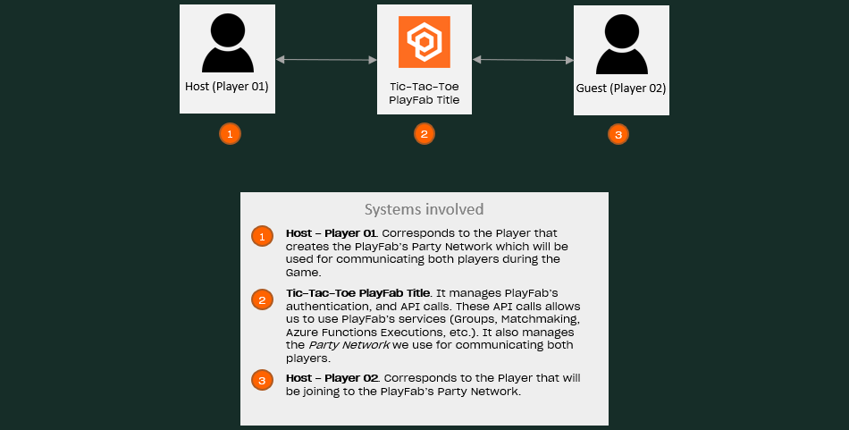

# Game Flow

## Index

- [Summary][summary]
- [Systems Involved][systems-involved]
- [Pre-requisites][pre-requisites]
- [Implementation][implementation]
  - [GameStateHandler: Use of Party network, sending of data messages, and custom events][gamestatehandler-use-of-party-network-sending-of-data-messages-and-custom-events]
    - [Data messages sending][data-messages-sending]
    - [Custom events of data receptions][custom-events-of-data-receptions]
  - [Use of Unity events][use-of-unity-events]

## Summary

This sample demonstrates how the multiplayer Tic-Tac-Toe game was implemented using PlayFab's services.

## Systems involved

The game flow process involves the following systems (to see an explanation about the complete architecture, refer to [root readme][root-readme]).

---

  

---

## Pre-requisites

- Read and complete the [PlayFab configuration][playfab-config-readme].
- Read and complete the [Azure Function configuration][azure-function-config-readme].
- Read and complete the [Cosmos DB configuration][cosmos-db-config-readme].

## Implementation

To handle the status synchronization, the game flow uses the PlayFab Party service for creating a network that allows exchanging data between both players.

The game flow starts with the reception of the `Players Ready` message, after the Party Network creation and joining of both players.

Then, the host sends the initial game state, with it, both game instances render the board.
From there the game flow consists of a loop as seems below.

---

![alt-text][game-flow-diagram-01]

---

This loop has been implemented relying on the events of data message receptions by the PlayFab Party and both the [`Start`][unity-event-start] and the [`Update`][unity-event-update] Unity event.

### GameStateHandler: Use of Party network, sending of data messages, and custom events.

#### Data messages sending

To manage the sending and reception of messages we create the [`GameStateHandler`][game-state-handler] class. It contains the [PlayFabMultiplayerManager][playfab-multiplayer-manager] instantiated in the [`Lobby`][lobby-party-network-handler-instantiating] script which manages the operations related to the Party network. As the [`PartyNetworkHandler`][party-network-handler] is responsible for the creation and join operations, the `GameStateHandler` manages the specific-messages sending operations for this game flow implementation.

It includes the following methods:

- [**SendGameState**][game-state-handler-send-game-state]
- [**SendMatchAbandonment**][game-state-handler-send-match-abandonment]
- [**SendMove**][game-state-handler-send-move]

These custom messages are sent using a wrapper to specify their type. By this way we can properly parse them in their respective classes in the message receptor.

##### Custom events of data receptions

Besides, it also allows us to create custom events built from the event [`OnDataMessageNoCopyReceived`][game-state-handler-on-data-message-no-copy-received] to straightforwardly manage the messages reception:

- **OnGameStateReceived:** Notifies the reception of a game state.
  The instances of the [GameState][game-class-model] class only are sent by the host and contains:

  - The board state
  - The turn player identifier
  - The [winner][game-winner-type], that is to say, the current game state:
    - None (there is no winner yet, the initial state)
    - Player one win
    - Player two win
    - Draw

  It is handled [here][game-class-on-game-state-received] in the `Game` script. It set the game state received as the `ApplicationModel.CurrentGameState`, that will be used in the [`UpdateGameAtNewTurn`][game-class-update-game-at-new-turn] method.

- **OnMoveReceived:** Notifies the reception of  new movement.
  The movement contains the row and column.
  This event is handled [here][game-class-on-move-received], where the host:

  - Generates a new game state from the movement and the previous state using the [`AddMoveToGameState`][game-class-add-move-to-game-state].
  - Set the game state received as the `ApplicationModel.CurrentGameState`.
  - Send the new game state.
  
- **OnMatchAbandonment:** Notifies the reception of match abandonment by one of the players.
  It is handled [here][game-class-on-match-abandonment], where is:

  - Set the winner into the game state
  - Send the game state to the guest

Additionally, all these events finish with setting `ApplicationModel.NewTurnToUpdate` property in `true` to trigger the updating of a new turn or the end game in the next [`Update`][unity-event-update] execution.

#### Use of Unity events

Two Unity Events are used to implements the game flow loop, these are the [`Start`][unity-event-start] and [`Update`][unity-event-update] events.

The [`Start`][game-class-start] Unity event of the [Game][game-class-file] script is used to initialize the `GameStateHandler` and set the handlers for the custom events. Lastly, the [`InitializeGame`][game-class-initialize-game] method is executed for sending the initial game state and set the`ApplicationModel.NewTurnToUpdate` in `true`.

The [`Update`][unity-event-update] event is used to handle each new turn, which is the same to say that process each new game state. In order that, the `ApplicationModel` property [is used to check][game-class-update] in each [`Update`][unity-event-update] execution if it needs to update the game because we are in new turn or the game has ended. 

At each of these situations is executed the [`UpdateGameAtNewTurn`][game-class-update-game-at-new-turn] method which:

- Renders the board with its new state
- Sets the `NewTurnToUpdate` property in `false` to avoid executes the process with the same game state in the next frame.
- Checks if there is an end game result and in that case:
  - Updates GUI 
  - Breaks out from the method execution
- If the turn is of the local player:
  - Waits and retrieve his movement
  - With the new movement:
    - If the player is the host 
      - Generates the game state state
      - Sets the `NewTurnToUpdate` property in `true`
      - [Sends][game-class-handle-new-local-move] the new game state to the guest
    - if the player is the guest
      - [Sends][game-class-handle-new-local-move] the movement to the host

Summarizing, every loop iteration is triggered by any of the events that modify the game state and the logic of the game loop is executed from the [`UpdateGameAtNewTurn`][game-class-update-game-at-new-turn] method.

<!-- IMAGES -->
[game-flow-diagram-01]: ./document-assets/images/diagrams/game-flow-diagram-01.png

<!-- READMEs -->
[playfab-config-readme]: ./TicTacToe/README.md
[azure-function-config-readme]: ./AzureFunctions/README.md
[cosmos-db-config-readme]: ./AzureFunctions/cosmos-db-configuration.md
[root-readme]: README.md

<!-- Game Class-->
[game-class-file]: ./TicTacToe/Assets/Scripts/Game.cs
[game-class-start]: ./TicTacToe/Assets/Scripts/Game.cs#L52
[game-class-update]: ./TicTacToe/Assets/Scripts/Game.cs#L77
[game-class-on-game-state-received]: ./TicTacToe/Assets/Scripts/Game.cs#L133
[game-class-on-move-received]: ./TicTacToe/Assets/Scripts/Game.cs#L139
[game-class-on-match-abandonment]: ./TicTacToe/Assets/Scripts/Game.cs#L21
[game-class-initialize-game]: ./TicTacToe/Assets/Scripts/Game.cs#L158
[game-class-update-game-at-new-turn]: ./TicTacToe/Assets/Scripts/Game.cs#L168
[game-class-handle-new-local-move]: ./TicTacToe/Assets/Scripts/Game.cs#L200
[game-class-add-move-to-game-state]: ./TicTacToe/Assets/Scripts/Game.cs#L213

<!-- Lobby Class -->
[lobby-party-network-handler-instantiating]: ./TicTacToe/Assets/Scripts/Lobby.cs#L55

<!-- Models -->

[game-class-model]: ./TicTacToe/Assets/Scripts/Models/GameState.cs
[game-winner-type]: ./TicTacToe/Assets/Scripts/Helpers/Game/GameWinnerType.cs

<!-- Handlers -->
[game-state-handler]: ./TicTacToe/Assets/Scripts/Handlers/GameStateHandler.cs
[game-state-handler-on-data-message-no-copy-received]: ./TicTacToe/Assets/Scripts/Handlers/GameStateHandler.cs#L42
[game-state-handler-send-data-message]: ./TicTacToe/Assets/Scripts/Handlers/GameStateHandler.cs#L60
[game-state-handler-send-game-state]: ./TicTacToe/Assets/Scripts/Handlers/GameStateHandler.cs#L66
[game-state-handler-send-match-abandonment]: ./TicTacToe/Assets/Scripts/Handlers/GameStateHandler.cs#L75
[game-state-handler-send-move]: ./TicTacToe/Assets/Scripts/Handlers/GameStateHandler.cs#L84
[game-status-handler-make-move]: ./TicTacToe/Assets/Scripts/Handlers/GameStatusHandler.cs#L46
[party-network-handler]: ./TicTacToe/Assets/Scripts/Handlers/PartyNetworkHandler.cs

<!-- Index -->
[summary]: #summary
[systems-involved]: #systems-involved
[pre-requisites]: #pre-requisites
[implementation]: #implementation
[gamestatehandler-use-of-party-network-sending-of-data-messages-and-custom-events]: #gamestatehandler-use-of-party-network-sending-of-data-messages-and-custom-events
[data-messages-sending]: #data-messages-sending
[custom-events-of-data-receptions]: #custom-events-of-data-receptions
[use-of-unity-events]: #use-of-unity-events

<!-- External -->

[unity-event-start]: https://docs.unity3d.com/ScriptReference/MonoBehaviour.Start.html
[unity-event-update]: https://docs.unity3d.com/ScriptReference/MonoBehaviour.Update.html
[playfab-multiplayer-manager]: https://docs.microsoft.com/gaming/playfab/features/multiplayer/networking/reference/unity-party-api/classes/playfabmultiplayermanager/
