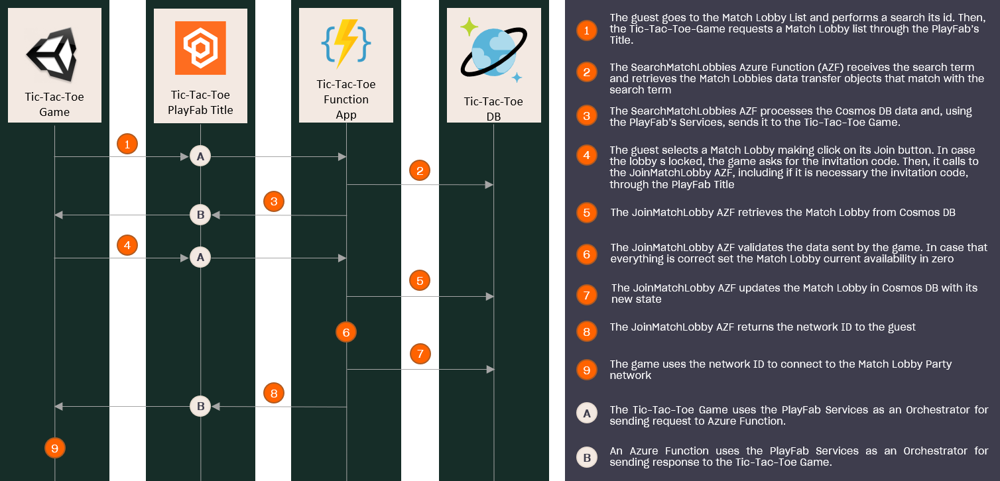
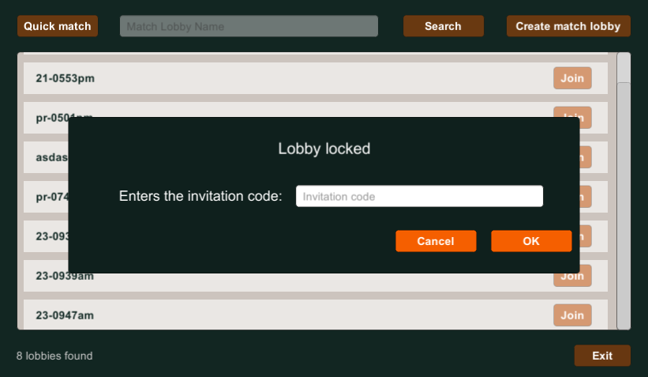

# Join to the Match Lobby

## Index

- [Summary][summary]
- [Pre-requisites][pre-requisites]
- [Architecture][architecture]
- [Implementation][implementation]
  - [Unity Game: Starts the connection process][unity-game-starts-the-connection-process]
  - [Azure Function App: JoinMatchLobby function][azure-function-app-joinmatchlobby-function]

## Summary

This sample demonstrates how to implement the join match lobby feature. It allows a player (known as the guest) to connect to an existing match lobby in order to play against another player.

Also, this sample implements the match lobby locking feature. Here we explain how the the invitation code is validated during the Join process.

For more information about how invitation code is managed during match lobby creation, check the [Match Lobby Creation document][match-lobby-creation-readme].

## Pre-requisites

- Read and complete the [PlayFab configuration][playfab-config-readme].
- Read and complete the [Azure Function configuration][azure-function-config-readme].
- Read and complete the [Cosmos DB configuration][cosmos-db-config-readme].
- Read the [Search Match Lobby][search-match-lobby-readme] implementation guide.
- Read the [Creation Match Lobby][match-lobby-creation-readme] implementation guide.

## Architecture

Before starting explaining how this feature works, lets see how the game was implemented:

---

---

## Implementation

The implementation of the Match Lobby creation feature has the following steps:

---

---

### Unity Game: Starts the connection process

The Unity Game is the first layer involved, once the game has [retrieved the lobbies list][search-match-lobby-readme] the player clicks the `Join` button of the desired Match Lobby.

---

  

---

In case the lobby is locked, the game asks the guest for the invitation code, to include it into join the match lobby request. This invitation code corresponds to the [`invitation ID`][pf-invitation-id] created during the Party network creation, and that is included in the `network ID`.

---

  

---

After that, the [`JoinMatchLobby`][mlh-join-match-lobby] method of the [`MatchLobbyHandler`][mlh] is executed, triggering the [`JoinMatchLobby`][jml] Azure Function.

### Azure Function App: JoinMatchLobby function

The Azure Function [`JoinMatchLobby`][jml] is responsible for:

- [Retrieving][jml-retrieves-match-lobby] from Cosmos DB the match lobby by its ID.
- Validating the match lobby:
  - [It must exist][jml-must-exist]. In another way, it returns the error `404 Not found`.
  - [It must not be full][jml-must-not-be-full]. In another way, it returns the error `502 Lobby full`.
  - The guest trying to join [must not be its creator][jml-must-not-be-its-creator]. In another way, it returns the error `513 Requester is lobby creator`.
  - If the lobby is locked:
    - The invitation code [must be included][jml-invitation-code-must-be-included]. In another way, it returns the error `432 Not invitation code included`.
    - The invitation code [must match][jml-invitation-code-must-match] with the `invitation ID` [extracted from the match lobby network ID][jml-extract-invitation-code-from-network-id]. In another way, it returns the error `514 Invalid invitation code`.
- [Updating][jml-update-in-cosmos-db] the match lobby in Cosmos DB:
  - Updates the current availability to zero.

The function receives the match lobby ID and optionally the `invitation ID`. Then, it will [retrieve the match lobby][jml-retrieves-match-lobby] from Cosmos DB by its ID, and finally, makes the validation described above.

Between the errors mentioned before, the code error `432 Not invitation code included` is a special case: it means that the host has locked the lobby between the time that the guest listed the lobbies and tried to join. On the first try, the guest's game won't ask for the invitation code and won't send the Join request.

Considering this, the joining function returns a specific error, hence the game can [handle it and restarts the joining flow][lby-handle-error-432] asking for the invitation code and requesting again the joining to the match lobby.

Another topic to clarify is the getting of the `invitation ID` - the `invitation code` from the guest game perspective - from the `network ID`. During the lobby creation, the [host includes the `network ID`][mlh-create-match-lobby] returned by the PlayFab SDK into the request to create the match lobby and store it in Cosmos DB. Inside this `network ID`, which is a string, [PlayFab includes][pf-network-identifier-composition] the `invitation ID`, a pipe character - `|` - as a separator, and the [network descriptor][pf-network-descriptor] serialized.

In the joining process, [the `invitation ID` is retrieved][jml-extract-invitation-code-from-network-id] from the `NetworkdId` attribute of the match lobby taking the substring from the start until the `|` separator to be used in the validation of the `invitation code` sent by the guest.

After passing the validations, it sets the current availability to zero, and the match lobby [is updated in Cosmos DB][jml-update-in-cosmos-db] with its new state.

Finally, the Join function [returns the `network ID`][jml-returns-network-id] included in a [wrapper][azf-response-wrapper], which includes the status code of the execution.

With this ID, the game joins to the Party network, which triggers an event on the host ([`OnRemotePlayersJoined`][pf-onremoteplayerjoined-event] event) that will end up rendering a new player in the match lobby players list.

For more details, you can read the documents about the [match lobby creation][match-lobby-creation-readme] and [match start][start-match-readme] process.

<!-- Index Links -->

[summary]: #summary
[pre-requisites]: #pre-requisites
[architecture]: #architecture
[implementation]: #implementation
[unity-game-starts-the-connection-process]: #unity-game-starts-the-connection-process
[azure-function-app-joinmatchlobby-function]: #azure-function-app-joinmatchlobby-function

<!-- READMEs -->

[search-match-lobby-readme]: ./search-match-lobby.md
[playfab-config-readme]: ./TicTacToe/README.md
[azure-function-config-readme]: ./AzureFunctions/README.md
[cosmos-db-config-readme]: ./AzureFunctions/cosmos-db-configuration.md
[start-match-readme]: ./start-match.md
[match-lobby-creation-readme]: ./create-match-lobby.md

<!-- AZURE FUNCTIONS -->

[jml]: ./AzureFunctions/TicTacToeFunctions/Functions/JoinMatchLobby.cs
[jml-retrieves-match-lobby]: ./AzureFunctions/TicTacToeFunctions/Util/MatchlobbyUtil.cs#L42
[jml-must-exist]: ./AzureFunctions/TicTacToeFunctions/Util/MatchlobbyUtil.cs#L44
[jml-must-not-be-full]: ./AzureFunctions/TicTacToeFunctions/Util/MatchlobbyUtil.cs#L49
[jml-must-not-be-its-creator]: ./AzureFunctions/TicTacToeFunctions/Util/MatchlobbyUtil.cs#L54
[jml-invitation-code-must-be-included]: ./AzureFunctions/TicTacToeFunctions/Util/MatchlobbyUtil.cs#L61
[jml-invitation-code-must-match]: ./AzureFunctions/TicTacToeFunctions/Util/MatchlobbyUtil.cs#L66

[jml-update-in-cosmos-db]: ./AzureFunctions/TicTacToeFunctions/Util/MatchlobbyUtil.cs#L77
[jml-extract-invitation-code-from-network-id]: ./AzureFunctions/TicTacToeFunctions/Util/MatchlobbyUtil.cs#L168
[jml-returns-network-id]: ./AzureFunctions/TicTacToeFunctions/Functions/JoinMatchLobby.cs#L30
[azf-response-wrapper]: ./AzureFunctions/TicTacToeFunctions/Models/Responses/ResponseWrapper.cs

<!-- Game -->

[mlh]: ./TicTacToe/Assets/Scripts/Handlers/MatchlobbyHandler.cs
[mlh-join-match-lobby]: ./TicTacToe/Assets/Scripts/Handlers/MatchlobbyHandler.cs#L26
[mlh-create-match-lobby]: ./TicTacToe/Assets/Scripts/Handlers/MatchlobbyHandler.cs#L51
[lby-handle-error-432]: ./TicTacToe/Assets/Scripts/Lobby.cs#L413

<!-- PlayFab References -->

[playfab-sdk]: https://github.com/PlayFab/CSharpSDK
[pf-invitation-id]: https://docs.microsoft.com/gaming/playfab/features/multiplayer/networking/concepts-invitations-security-model#identifiers
[pf-network-identifier-composition]: https://docs.microsoft.com/gaming/playfab/features/multiplayer/networking/concepts-discovery#advertising-a-network
[pf-network-descriptor]: https://docs.microsoft.com/gaming/playfab/features/multiplayer/networking/reference/structs/partynetworkdescriptor
[pf-onremoteplayerjoined-event]: https://docs.microsoft.com/gaming/playfab/features/multiplayer/networking/reference/unity-party-api/classes/playfabmultiplayermanager/events/partyunityonremoteplayerjoined
