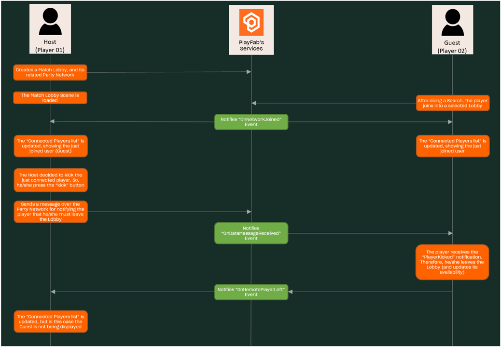

# Kick player from Match Lobby

## Index

- [Summary][summary]
- [Pre-requisites][pre-requisites]
- [Systems Involved][systems-involved]
- [Implementation][Implementation]
  - [Part 1][part-1---before-the-OnRemotePlayerJoined-event]
  - [Part 2][part-2---after-the-onRemotePlayerJoined-and-before-the-OnDataMessageReceived-event]
  - [Part 3][part-3---after-the-onDataMessageReceived-event-and-before-the-onRemotePlayerLeft-event]
  - [Part 4][part-4---After-the-onRemotePlayerLeft-event]

## Summary

This document describes how the *Kick player* feature was implemented in the current sample. This feature allows those Match Lobby creators to kick at will any player connected to the Lobby *before* the game starts.

## Pre-requisites

- Read and complete the [PlayFab configuration][playfab-config-readme].
- Read and complete the [Azure Function configuration][azure-function-config-readme].
- Read and complete the [Cosmos DB configuration][cosmos-db-config-readme].
- Read the [Create Match Lobby][create-match-lobby-readme] implementation guide.
- Read the [Join Match Lobby][join-match-lobby-readme] implementation guide.

## Systems involved

This is the current architecture we're using for implementing the Match Lobby feature:

---

---

## Implementation

The implementation of the *Kick Player* feature has the following steps:

---

---

Considering the three main events that could happen in this process as separators, this process will have four main parts"

- Part 1: this part happens before the `OnRemotePlayerJoined` event, which is triggered when the guest joins into a Match Lobby.
- Part 2: this part happens after the `OnRemotePlayerJoined` event happens, and before the 
OnDataMessageReceived is triggered by the host.
- Part 3: this part happens between the `OnDataMessageReceived` and `OnRemotePlayerLeft` events.
- Part 4: this part is started after the `OnRemotePlayerLeft` is triggered.

### Part 1 - Before the OnRemotePlayerJoined event

At this point, the host has created a Match Lobby and the Match Lobby scene has been loaded. By the other side, the guest performs a Match Lobby search, and selects a lobby to [join to][lobby-script-join-to-lobby]. 

As the guest is joining to the lobby, they will also be [joining into a PlayFab's Party Network][lobby-script-join-to-network], and this action triggers the [OnRemotePlayerJoined][party-network-on-remote-player-joined] event.

### Part 2 - After the OnRemotePlayerJoined and before the OnDataMessageReceived event

As the guest has joined the network and thus triggers the mentioned event, the host will receive this event (through the party network), and will [handle it][match-lobby-script-on-remote-player-joined-listener]. After this, their connected players list will be updated, showing the guest information, and next to it will be the `Kick` button. If the guest [press this button][match-lobby-script-on-kick-button-click], they will send the *PlayerKicked* message over the Party network for notifying the guest that they are being expelled from the lobby. This message will trigger the [OnDataMessageReceived][party-network-on-data-message-received] event.

### Part 3 - After the OnDataMessageReceived event and before the OnRemotePlayerLeft event

When the host notifies to the guest that they are being kicked from the lobby, an event is triggered in the party network.

The guest, when [handling the event][match-lobby-script-on-data-message-no-copy-received-listener], will [check if the message][match-lobby-script-process-player-kicked-message] was sent to them or not, as this message contains the kicked player's ID. In case it was sent to them, the guest will call the [LeaveMatchLobby][azf-leave-match-lobby] Azure Function for leaving the current lobby (***NOTE***: here the match lobby's [availability is updated][match-lobby-util-update-availability]), and then will leave the party network.

All these actions are performed in the [LeaveMatchProcess][match-lobby-script-leave-match-process] method. This last action will trigger the [OnRemotePlayerLeft][party-network-on-remote-player-left] event.

### Part 4 - After the OnRemotePlayerLeft event

After the kick process is completed, the host will handle the [OnRemotePlayerLeft][party-network-on-remote-player-left]. When doing this, the [connected player's list will be updated][match-lobby-player-list-populate-render-list], and the guest information won't be displayed anymore.

<!-- Index -->
[summary]: #summary
[pre-requisites]: #pre-requisites
[systems-involved]: #systems-involved
[Implementation]: #implementation
[part-1---before-the-OnRemotePlayerJoined-event]: #part-1---before-the-onremoteplayerjoined-event
[part-2---after-the-onRemotePlayerJoined-and-before-the-OnDataMessageReceived-event]: #part-2---after-the-onremoteplayerjoined-and-before-the-ondatamessagereceived-event
[part-3---after-the-onDataMessageReceived-event-and-before-the-onRemotePlayerLeft-event]: #part-3---after-the-ondatamessagereceived-event-and-before-the-onremoteplayerleft-event
[part-4---After-the-onRemotePlayerLeft-event]: #part-4---after-the-onremoteplayerleft-event

<!-- READMEs -->

[playfab-config-readme]: ./TicTacToe/README.md
[azure-function-config-readme]: ./AzureFunctions/README.md
[cosmos-db-config-readme]: ./AzureFunctions/cosmos-db-configuration.md

[create-match-lobby-readme]: ./create-match-lobby.md
[join-match-lobby-readme]: ./join-to-the-match-lobby.md

<!-- Lobby file references -->
[lobby-script]: ./TicTacToe/Assets/Scripts/Lobby.cs
[lobby-script-join-to-lobby]: ./TicTacToe/Assets/Scripts/Lobby.cs#L368
[lobby-script-join-to-network]: ./TicTacToe/Assets/Scripts/Lobby.cs#L378

<!-- Match Lobby scene file references -->
[lobby-script]: ./TicTacToe/Assets/Scripts/MatchLobbyScene.cs
[match-lobby-script-on-remote-player-joined-listener]: ./TicTacToe/Assets/Scripts/MatchLobbyScene.cs#L304
[match-lobby-script-on-kick-button-click]: ./TicTacToe/Assets/Scripts/MatchLobbyScene.cs#L402
[match-lobby-script-on-data-message-no-copy-received-listener]: ./TicTacToe/Assets/Scripts/MatchLobbyScene.cs#L328
[match-lobby-script-process-player-kicked-message]: ./TicTacToe/Assets/Scripts/MatchLobbyScene.cs#L285
[match-lobby-script-leave-match-process]: ./TicTacToe/Assets/Scripts/MatchLobbyScene.cs#L204

[match-lobby-player-list-populate]: ./TicTacToe/Assets/Scripts/Components/MatchLobbyPlayerListPopulate.cs
[match-lobby-player-list-populate-render-list]: ./TicTacToe/Assets/Scripts/Components/MatchLobbyPlayerListPopulate.cs#L37

<!-- AZ Functions -->
[azf-leave-match-lobby]: ./AzureFunctions/TicTacToeFunctions/Functions/LeaveMatchLobby.cs
[match-lobby-util]: ./AzureFunctions/TicTacToeFunctions/Util/MatchlobbyUtil.cs
[match-lobby-util-update-availability]: ./AzureFunctions/TicTacToeFunctions/Util/MatchlobbyUtil.cs#L86

<!-- Party Network references -->
[party-network-on-remote-player-joined]: https://docs.microsoft.com/en-us/gaming/playfab/features/multiplayer/networking/reference/unity-party-api/classes/playfabmultiplayermanager/events/partyunityonremoteplayerjoined
[party-network-on-data-message-received]: https://docs.microsoft.com/en-us/gaming/playfab/features/multiplayer/networking/reference/unity-party-api/classes/playfabmultiplayermanager/events/partyunityoneatamessagereceived
[party-network-on-remote-player-left]: https://docs.microsoft.com/en-us/gaming/playfab/features/multiplayer/networking/reference/unity-party-api/classes/playfabmultiplayermanager/events/partyunityonremoteplayerleft
