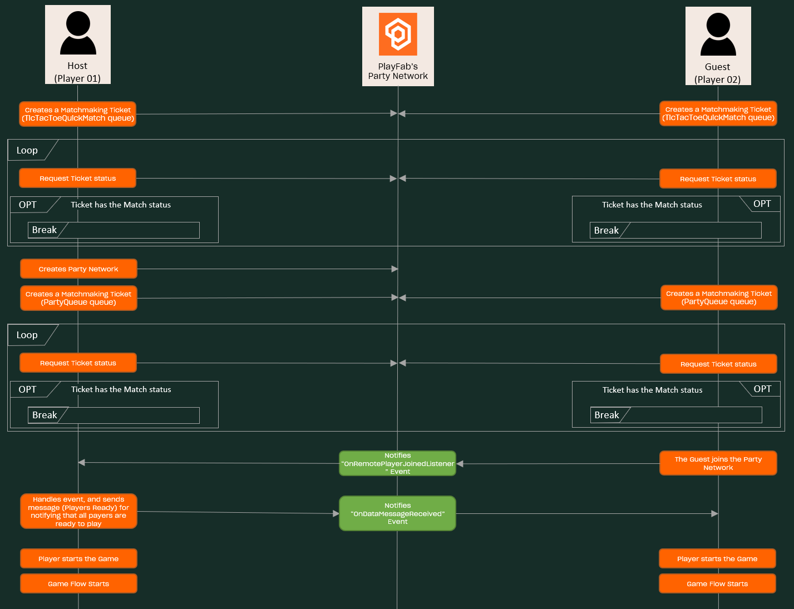

# Quick Match

## Index

- [Summary][summary]
- [Systems Involved][architecture]
- [Pre Requisites][pre-requisites]
- [Implementation][implementation]
  - [Process flow][process-flow]
    - [Process description][process-description]
    - [Matchmaking][matchmaking]
      - [Matchmaking Queues][matchmaking-queues]
      - [Matchmaking Handler][matchmaking-handler]
      - [Creating Matchmaking Ticket][creating-matchmaking-ticket]
      - [Getting a Matchmaking Ticket Status][getting-a-matchmaking-ticket-status]
    - [PlayFab Party Network][playfab-party-network-index]
      - [Creating the Party Network][creating-the-party-network]
      - [Joining the Party Network][joining-the-party-network]
      - [Party Network Events][party-network-events]

## Summary

This sample demonstrates how to implement a **Quick Match** using PlayFab's services. This feature will allow the players to play a match instantly, without the need of looking for an specific match.

## Systems Involved

Before starting explaining how this feature works, let's see how the game was implemented.

---

<!-- [architecture-01] -->

  

---

Regarding the **Quick Match** feature, we can add the next information:

- Tic-Tac-Toe game: this is implemented in [this project][unity-game-project]. Here we've the Quick Match option, where we can start a match.

## Pre-requisites

- Read and complete the [PlayFab configuration][playfab-config-readme].

## Implementation

### Process Flow

---

<!-- [quick-match-party] -->

  

---

#### Process Description

The Quick Match feature allows players to play against others randomly-selected players. For starting this process, the players would have to click the Quick Match button from the Lobby menu:

---

<!-- [quick-match-party] -->

  

---

Once this happens, the game creates a matchmaking ticket for the player, in order to pair him with another unknown player. After this, the game will request the ticket status until a match happens. This process is described in a more detailed way [here][matchmaking].

Then, the game will determine the player one and two, based on the alphabetical order of their respective IDs. This is an important step, as each of these players has a different responsibility:

 - The *Player One* or *Host* will create the [PlayFab Party Network][playfab-party-network], which main purpose is allowing players to share information used in the game. This process is described in a more detailed way [here][creating-the-party-network].
 - The *Player Two* or *Guest* will be joining the created network, triggering an event that starts the game for both players. This process is described in a more detailed way [here][joining-the-party-network].

As the host is the only one that has the party network ID, and the guest needs it for joining the network, we were in the need of defining a process for sharing information between two matched players. For this, we've decided to create a new matchmaking ticket, but in this case, we use the previous match ID as a [Matching attribute][ttt-lobby-file-PreparePartyQuickMatch-match-creation], which ensure us that both players will be Matched again. In this new ticket, the host will pass the network ID. All these steps are performed in the [PreparePartyQuickMatch][ttt-lobby-file-PreparePartyQuickMatch] method from the [Lobby.cs][ttt-lobby-file] file.

Once the second match happens, the guest will be [joining to the Network][ttt-lobby-file-ProcessPartyQuickMatch-join-network]. This will trigger an event that the host will handle with [this method][ttt-lobby-file-OnRemotePlayerJoinedListener]. Here, the host will send the `Players Ready` message (triggering a Network event), for notifying that both players are ready to play the game. This message will be processed [here][ttt-lobby-file-OnDataMessageNoCopyReceivedListener], and after that, the [Game Flow][game-flow-readme] will start.

#### Matchmaking

##### Matchmaking Queues
In this project we're currently using the [PlayFab Matchmaking][playfab-matchmaking-documentation] feature, which allows us to match two players given some specific attributes. For creating, querying status, and canceling tickets we've to use a matchmaking queue, but in our case we need to use two different queues:

- **TicTacToeQuickMatch** queue: this queue will be in charge of matching two players in a random way.
- **PartyQueue** queue: this queue will match two players based on a given attribute: the `PreviousMatchId`, which is the match ID that was previously created in the [Quick-Match process][process-description].
> Note: the host player will specify the party network attribute in the PartyQueue queue.

For having more information on how to configure these queues, check [this document][playfab-config-readme].

##### Matchmaking Handler

For managing all the matchmaking-related tasks, we have the [MatchmakingHandler][ttt-matchmaking-handler] class. Here we wrap some useful PlayFab's API methods for using in our game, like the [Matchmaking Ticket Creation][ttt-matchmaking-handler-create-ticket], [Getting the Ticket Status][ttt-matchmaking-handler-get-ticket-status], [Cancelling a Ticket][ttt-matchmaking-handler-cancel-tickets], or for [Getting the Match information][ttt-matchmaking-handler-get-match].

As in our case we're managing two different classes of queues, the **TicTacToeQuickMatch*- and **PartyQueue*- queues (more info [here][matchmaking-queues]), we decided to use the [MatchmakingQueueConfiguration][MatchmakingQueueConfiguration] class and its hierarchy: [QuickMatchQueueConfiguration][QuickMatchQueueConfiguration] and [PartyQueueConfiguration][PartyQueueConfiguration]. We decide which of this configuration use through the [ChangeQueueConfiguration][ttt-matchmaking-handler-change-queue-config] method at any time, specifying the [type][MatchmakingEnums-queue-types] we want to use.

##### Creating Matchmaking Ticket

In the [MatchmakingHandler][ttt-matchmaking-handler] class we have the [CreateTicket][ttt-matchmaking-handler-create-ticket] method that allows us to create a matchmaking ticket. Here we're using the [Create Ticket][playfab-api-create-matchmaking-ticket] method from the PlayFab's API. Something important to highlight here is how we manage the creation for each queue type we have so far:
- **TicTacToeQuickMatch** queue: here we're using the [GetMatchmakingPlayerAttributes][QuickMatchQueueConfiguration-GetMatchmakingPlayerAttributes] method from the [QuickMatchQueueConfiguration][QuickMatchQueueConfiguration] class. This method returns the specific attribute we'll use in this queue.
- **PartyQueue** queue: here we're using the [GetMatchmakingPlayerAttributes][PartyQueueConfiguration-GetMatchmakingPlayerAttributes] method from the [PartyQueueConfiguration][[PartyQueueConfiguration]] class. In this method we specify both the `PreviousMatchId` and the `NetworkId` attributes, both used in the [Quick-Match process][process-description].

##### Getting a Matchmaking Ticket Status

In the [MatchmakingHandler][ttt-matchmaking-handler] class we have the [GetTicketStatus][ttt-matchmaking-handler-get-ticket-status] method for retrieving the ticket status. In this case, we're using the [Get Matchmaking Ticket][playfab-api-get-matchmaking-ticket-status] API method. Also, we have the [EnsureGetTicketStatus][ttt-matchmaking-handler-ensure-get-ticket-status] method, which queries the ticket Status for an specified amount of time.

#### PlayFab Party Network

For communicating both players we're using the [PartyNetworkHandler][party-network-handler] class, which uses the PlayFab's [Party Network][playfab-party-network] services.
 
##### Creating the Party Network

For creating the network, we're using the [CreateAndJoinToNetwork][party-network-handler-create-and-join-to-network] method, which creates and joins the player to the network, retrieving its ID. More precisely, this is executed in [this method][ttt-lobby-file-create-and-join-party-network] of the [Lobby.cs][ttt-lobby-file] file.

##### Joining the Party Network

In the [PartyNetworkHandler][party-network-handler] class we have the [JoinNetwork][party-network-handler-join-to-network] method that allows a player joining to an specified network. We use this method [here][ttt-lobby-file-join-party-network] in the [Lobby.cs][ttt-lobby-file] file.

##### Party Network Events
In the `Quick-Match` process case we're working with two Network events:
- **OnRemotePlayerJoined**: we handle this event with the [OnRemotePlayerJoinedListener][ttt-lobby-file-OnRemotePlayerJoinedListener] method. This event allows the host to know when the guest has joined the network. After this, the host will send a `Players Ready` message over the network, for notifying the network players that all of them are ready to play.
- **OnDataMessageNoCopyReceived**: this event is triggered after a player sends a message over the network. We manage this event with the [OnDataMessageNoCopyReceivedListener][ttt-lobby-file-OnDataMessageNoCopyReceivedListener] method, which allows the guest (and the other Network's players) when they can start the game.

<!-- READMEs -->
[playfab-config-readme]: ./TicTacToe/README.md
[game-flow-readme]: ./game-flow.md

<!-- IMAGES -->
[architecture-01]: ./document-assets/images/diagrams/game-flow-systems-involved.png

[quick-match-party]: ./document-assets/images/diagrams/quick-match-party.png

<!-- Projects -->
[unity-game-project]: .

[playfab-matchmaking-documentation]: https://docs.microsoft.com/gaming/playfab/features/multiplayer/matchmaking/
[playfab-matchmaking-quickstart]: https://docs.microsoft.com/gaming/playfab/features/multiplayer/matchmaking/quickstart

<!-- TicTacToe Lobby -->
[ttt-lobby-file]: ./TicTacToe/Assets/Scripts/Lobby.cs
[ttt-lobby-file-PreparePartyQuickMatch]: ./TicTacToe/Assets/Scripts/Lobby.cs#L205
[ttt-lobby-file-PreparePartyQuickMatch-match-creation]: ./TicTacToe/Assets/Scripts/Lobby.cs#L227
[ttt-lobby-file-ProcessPartyQuickMatch]: ./TicTacToe/Assets/Scripts/Lobby.cs#L231
[ttt-lobby-file-ProcessPartyQuickMatch-join-network]: ./TicTacToe/Assets/Scripts/Lobby.cs#L245
[ttt-lobby-file-OnRemotePlayerJoinedListener]: ./TicTacToe/Assets/Scripts/Lobby.cs#L479
[ttt-lobby-file-OnDataMessageNoCopyReceivedListener]: ./TicTacToe/Assets/Scripts/Lobby.cs#L499
[ttt-lobby-file-create-and-join-party-network]: ./TicTacToe/Assets/Scripts/Lobby.cs#L219
[ttt-lobby-file-join-party-network]: ./TicTacToe/Assets/Scripts/Lobby.cs#L231

<!-- Matchmaking Handler -->
[ttt-matchmaking-handler]: ./TicTacToe/Assets/Scripts/Handlers/MatchmakingHandler.cs
[ttt-matchmaking-handler-create-ticket]: ./TicTacToe/Assets/Scripts/Handlers/MatchmakingHandler.cs#L30
[ttt-matchmaking-handler-get-ticket-status]: ./TicTacToe/Assets/Scripts/Handlers/MatchmakingHandler.cs#L51
[ttt-matchmaking-handler-cancel-tickets]: ./TicTacToe/Assets/Scripts/Handlers/MatchmakingHandler.cs#L78
[ttt-matchmaking-handler-get-match]: ./TicTacToe/Assets/Scripts/Handlers/MatchmakingHandler.cs#110
[ttt-matchmaking-handler-ensure-get-ticket-status]: ./TicTacToe/Assets/Scripts/Handlers/MatchmakingHandler.cs#138
[ttt-matchmaking-handler-change-queue-config]: ./TicTacToe/Assets/Scripts/Handlers/MatchmakingHandler.cs#161

<!-- QUEUE CONFIG HIERARCHY -->
[MatchmakingQueueConfiguration]: ./TicTacToe/Assets/Scripts/Helpers/Service/MatchmakingQueueConfiguration.cs

[QuickMatchQueueConfiguration]: ./TicTacToe/Assets/Scripts/Helpers/Service/QuickMatchQueueConfiguration.cs
[QuickMatchQueueConfiguration-GetMatchmakingPlayerAttributes]: ./TicTacToe/Assets/Scripts/Helpers/Service/QuickMatchQueueConfiguration.cs#L19

[PartyQueueConfiguration]: ./TicTacToe/Assets/Scripts/Helpers/Service/PartyQueueConfiguration.cs
[PartyQueueConfiguration-GetMatchmakingPlayerAttributes]: ./TicTacToe/Assets/Scripts/Helpers/Service/PartyQueueConfiguration.cs#L19

[MatchmakingEnums]: ./TicTacToe/Assets/Scripts/Helpers/Service/MatchmakingEnums.cs
[MatchmakingEnums-queue-types]: ./TicTacToe/Assets/Scripts/Helpers/Service/MatchmakingEnums.cs#L11

<!-- Party Network Handler -->
[party-network-handler]: ./TicTacToe/Assets/Scripts/Handlers/PartyNetworkHandler.cs
[party-network-handler-create-and-join-to-network]: ./TicTacToe/Assets/Scripts/Handlers/PartyNetworkHandler.cs#L44
[party-network-handler-join-to-network]: ./TicTacToe/Assets/Scripts/Handlers/PartyNetworkHandler.cs#L55

<!-- Match Handler -->
[match-handler]: ./TicTacToe/Assets/Scripts/Handlers/MatchHandler.cs

<!-- PlayFab API - Matchmaking -->
[playfab-api-create-matchmaking-ticket]: https://docs.microsoft.com/rest/api/playfab/multiplayer/matchmaking/creatematchmakingticket?view=playfab-rest
[playfab-api-get-matchmaking-ticket-status]: https://docs.microsoft.com/rest/api/playfab/multiplayer/matchmaking/getmatchmakingticket?view=playfab-rest
[playfab-api-get-status-notes]: https://docs.microsoft.com/gaming/playfab/features/multiplayer/matchmaking/quickstart#check-the-status-of-the-matchmaking-ticket

<!-- PlayFab Party -->
[playfab-party-network]: https://docs.microsoft.com/en-us/gaming/playfab/features/multiplayer/networking/

<!-- Index Links -->
[summary]: #summary
[architecture]: #architecture
[pre-requisites]: #pre-requisites
[implementation]: #implementation
[process-flow]: #process-flow
[process-description]: #process-description
[matchmaking]: #matchmaking
[matchmaking-queues]: #matchmaking-queues
[matchmaking-handler]: #matchmaking-handler
[creating-matchmaking-ticket]: #creating-matchmaking-ticket
[getting-a-matchmaking-ticket-status]: #getting-a-matchmaking-ticket-status
[playfab-party-network-index]: #playfab-party-network
[creating-the-party-network]: #creating-the-party-network
[joining-the-party-network]: #joining-the-party-network
[party-network-events]: #party-network-events
