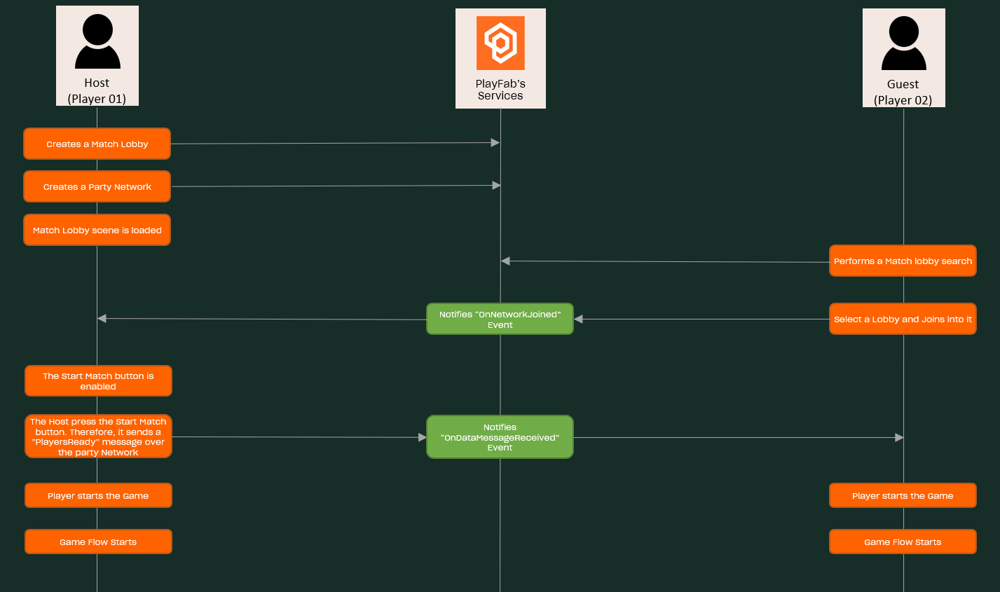
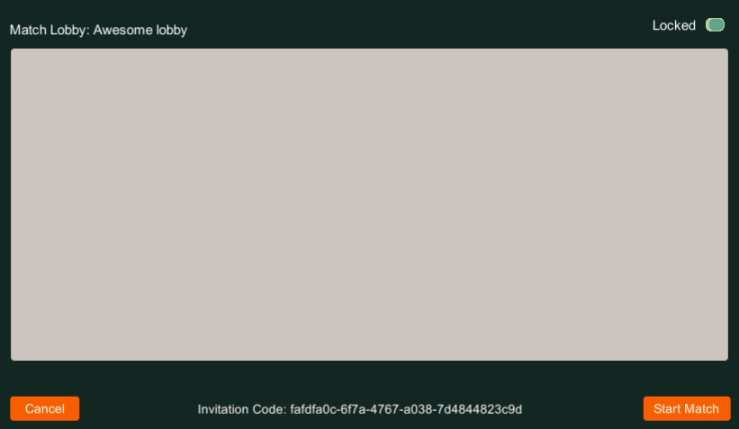

# PlayFab - Multiplayer Tic-Tac-Toe - Start Match flow

## Index

- [Summary][summary]
- [Implementation][implementation]
  - [Match Lobby][implementation-match-lobby]
    - [Step 01: Before OnNetworkJoined event][implementation-match-lobby-step01]
    - [Step 02: Between OnNetworkJoined and OnDataMessageReceived events][implementation-match-lobby-step02]
    - [Step 03: After OnDataMessageReceived event][implementation-match-lobby-step03]
  - [Quick Match][implementation-quick-match]

## Summary

This document explains how the Start Match flow was designed.

This flow is the step that links the Lobby scene with the game scene, and makes sure players are ready to play the match.

Despite the fact that this process is implemented in both, the Quick Match, and the Match Lobby cases, there is a minimal difference: the Match Lobby process has one extra step, where the host will be in charge of starting the match by pressing a specific button.

## Implementation

### Match Lobby

---

  

---

In the Match Lobby case we have three main steps:

- Step 01: Before the `OnNetworkJoined` event is triggered.
- Step 02: Between the `OnNetworkJoined` event and the `OnDataMessageReceived` event.
- Step 03: After the `OnDataMessageReceived` event.

#### Step 01: Before OnNetworkJoined event

In this part both the Host and Guest players are involved.

On one hand, the host will be in charge of creating the Match Lobby itself, which includes also the creation of the `Party Network` the game will be using for communicating the players. For more information on this, read the [create match lobby][create-match-lobby-readme] documentation.

On the other hand, we have the guest who will be searching for a specific lobby, and then joining to it (for more information on this, check the [search match lobby][search-match-lobby-readme] and [join to match lobby][join-match-lobby-readme] documents). The most important thing to highlight here is that, as the guest is joining the Party Network related to the Match Lobby, he/she will be triggering the [OnNetworkJoined][party-network-on-remote-player-joined] event.

#### Step 02: Between OnNetworkJoined and OnDataMessageReceived events

This step starts after the host handles the [OnNetworkJoined][party-network-on-remote-player-joined] event through the [OnRemotePlayerJoinedListener][match-lobby-script-on-remote-player-joined-listener] method from the [MatchLobbyScene][match-lobby-scene-script] script.

In this case, the game will be in charge of updating the connected player list from the host's view, through the [RenderList][match-lobby-player-list-populate-render-list] method from the [MatchLobbyPlayerListPopulate][match-lobby-player-list-populate] script. It is also in charge of enabling the *Start Match* button.

> NOTE: The Start Match button is only available in the host's view.

---

  

---

This button enables the host to start the match at will when the necessary conditions for starting it are met. The conditions are controlled through the [StartMatchConditionsMet][match-lobby-scene-script-conditions-met] method from the [MatchLobbyScene][match-lobby-scene-script] script, which is called by the [OnRemotePlayerJoinedListener][match-lobby-script-on-remote-player-joined-listener] method.

> NOTE: So far, we've only one condition, which is that there must be only two players in the lobby (host and guest).

When the host press this button, they will start the game, and also will [send a `PlayersReady` message][match-lobby-scene-script-send-players-ready] over the Party Network for notifying that all the players must start the game.

#### Step 03: After OnDataMessageReceived event

In this case, the guest will handle the [OnDataMessageReceived][party-network-on-data-message-received] event using the [OnDataMessageNoCopyReceivedListener][match-lobby-scene-script-OnDataMessageNoCopyReceivedListener] method. More specifically, it will be calling the [ProcessPlayersReadyMessage][match-lobby-scene-script-ProcessPlayersReadyMessage], where the game will be started.

### Quick Match

---

  

---

The [StartMatch][lobby-start-match] method purpose is to swap from the Lobby scene to the game scene after both players are ready to play. This validation is performed [here][lobby-start-match-validation], after we check the number of players we currently have in the network.

Both players, herein *Player One* and *Player Two*, will execute the `StartMatch` method in two different situations, regardless of whether they are in a Quick Match or Match Lobby game:

- **Player one**: This is the network creator, he/she executes the method after handling the [OnRemotePlayerJoined][lobby-on-remote-player-joined-listener] event (i.e. after player two joins the network).
- **Player two**: This player executes the method after receiving the `Players Ready` notification from Player One, when he/she handles the [OnDataMessageNoCopyReceived][lobby-on-data-message-no-copy-received-listener].

For more details, you can read the document about the [quick match][quick-match-readme] process.

Once both players have executed the [StartMatch][lobby-start-match] method both game instances enter into the flow described in the [game flow document][game-flow-readme].

<!-- Index -->

[summary]: #summary
[implementation]: #implementation
[implementation-match-lobby]: #match-lobby
[implementation-match-lobby-step01]: #step-01-before-onnetworkjoined-event
[implementation-match-lobby-step02]: #step-02-between-onnetworkjoined-and-ondatamessagereceived-events
[implementation-match-lobby-step03]: #step-03-after-ondatamessagereceived-event
[implementation-quick-match]: #quick-match

<!-- Links -->

[lobby]: ./TicTacToe/Assets/Scripts/Lobby.cs
[lobby-start-match]: ./TicTacToe/Assets/Scripts/Lobby.cs#L298
[lobby-start-match-validation]: ./TicTacToe/Assets/Scripts/Lobby.cs#L301
[lobby-on-remote-player-joined-listener]: ./TicTacToe/Assets/Scripts/Lobby.cs#L534
[lobby-on-data-message-no-copy-received-listener]: ./TicTacToe/Assets/Scripts/Lobby.cs#L560

<!-- Match Lobby scene file references -->

[match-lobby-scene-script]: ./TicTacToe/Assets/Scripts/MatchLobbyScene.cs
[match-lobby-script-on-remote-player-joined-listener]: ./TicTacToe/Assets/Scripts/MatchLobbyScene.cs#L348
[match-lobby-scene-script-conditions-met]: ./TicTacToe/Assets/Scripts/MatchLobbyScene.cs#L155
[match-lobby-scene-script-send-players-ready]: ./TicTacToe/Assets/Scripts/MatchLobbyScene.cs#L265
[match-lobby-scene-script-OnDataMessageNoCopyReceivedListener]: ./TicTacToe/Assets/Scripts/MatchLobbyScene.cs#L374
[match-lobby-scene-script-ProcessPlayersReadyMessage]: ./TicTacToe/Assets/Scripts/MatchLobbyScene.cs#L306

[match-lobby-player-list-populate]: ./TicTacToe/Assets/Scripts/Components/MatchLobbyPlayerListPopulate.cs
[match-lobby-player-list-populate-render-list]: ./TicTacToe/Assets/Scripts/Components/MatchLobbyPlayerListPopulate.cs#L37

<!-- Party Network references -->

[party-network-on-remote-player-joined]: https://docs.microsoft.com/gaming/playfab/features/multiplayer/networking/reference/unity-party-api/classes/playfabmultiplayermanager/events/partyunityonremoteplayerjoined
[party-network-on-data-message-received]: https://docs.microsoft.com/gaming/playfab/features/multiplayer/networking/reference/unity-party-api/classes/playfabmultiplayermanager/events/partyunityoneatamessagereceived
[party-network-on-remote-player-left]: https://docs.microsoft.com/gaming/playfab/features/multiplayer/networking/reference/unity-party-api/classes/playfabmultiplayermanager/events/partyunityonremoteplayerleft

<!-- READMEs -->
[create-match-lobby-readme]: ./create-match-lobby.md
[join-match-lobby-readme]: ./join-to-the-match-lobby.md
[search-match-lobby-readme]: ./search-match-lobby.md
[quick-match-readme]: ./quick-match.md
[game-flow-readme]: ./game-flow.md
