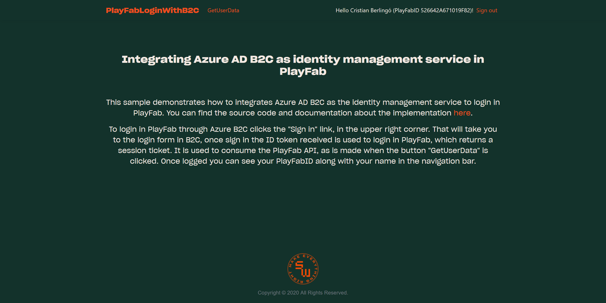
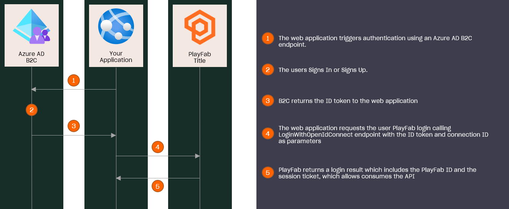

# Integrate PlayFab with Azure AD B2C as an Identity Management service

## Index

- [Summary][summary]
  - [Prerequisites][prerequisites]
- [Run the sample][run-the-sample]
  - [Configure the sign-in user flow in Azure AD B2C][configure-the-sign-in-user-flow-in-azure-ad-b2c]
  - [Configure the Open ID Connection in PlayFab][configure-the-open-id-connection-in-playfab]
  - [Configure the MVC web application][configure-the-mvc-web-application]
- [Highlights][highlights]
  - [Open ID Connection creation][open-id-connection-creation]
  - [Login with Open ID Connect in PlayFab][login-with-open-id-connect-in-playfab]

## Summary

Here we demonstrate how to integrate Azure AD B2C as an Identity Management Service into the PlayFab login process.

This sample includes a .NET core MVC project that uses B2C as an Authentication service, uses the ID token retrieved to login in PlayFab through the [LoginWithOpenIDConnect][pf-loginwithopenidconnect] API endpoint, that allows login a user with an ID token expedited by an Identity Provider that comply with [Open ID Connect][open-id-connect-definition] standard.

Besides that, the sample stores the [`SessionTicket`][pf-login-result] returned by PlayFab in a successful login and uses it to update - with the claims returned in the ID Token - and get the user data, to show how to store and use the session ticket to consume the PlayFab API on behalf the user.

In this document, we are going to explain the steps required to configure the MVC application and PlayFab to make work the login process.

---



---

### Prerequisites

If you are new to Azure AD B2C or custom policies, we recommend reading the following Microsoft documentation:

- [What is Azure Active Directory B2C?][azure-b2c-overview]
- [Custom policies in Azure Active Directory B2C][custom-policies-overview]
- [Get started with custom policies in Azure Active Directory B2C][custom-policies-get-started].

## How this works

This diagram explains the flow of the Sign In / Sign Up integrating Azure AD B2C as the Identity Management Service with PlayFab.

---



---

## Run the sample

### Configure the sign-in user flow in Azure AD B2C

First, you have to have a policy, which can be a user flow or custom policy where the user will enter his credentials.

If you don't have anyone yet, you can follow one of these documents:

- [Tutorial: Create user flows in Azure Active Directory B2C][b2c-create-user-flow-walkthrough]
- [Get started with custom policies in Azure Active Directory B2C][custom-policies-get-started]

To just run this sample, we recommend using a user flow, which is the simplest option.

>  NOTE: This sample can be used with a user flows as a custom policy. 

### Configure the Open ID Connection in PlayFab

Once you have the B2C resources created, you have to retrieve the endpoint of the Open ID Connect metadata document from the application that you created during the policy creation. 

For that, you have to refer to your Azure B2C in the [portal][azure-portal] and retrieved as is shown below.

---

![Retrieving B2C application endpoints][retrieving-b2c-application-endpoints]

---

Then, you have to replace the `<policy-name>` placeholder with the name of your policy, for instance, if your policy has the name `b2c_1_susi` in this case the URL is `https://b2cplayfab.b2clogin.com/b2cplayfab.onmicrosoft.com/b2c_1_susi/v2.0/.well-known/openid-configuration`.

Go to that URL, from there you can retrieve the rest of the endpoints and data needed to create the Open ID Connection. You will see a document that starts with the following structure:

```json
{

  "issuer": "https://b2cplayfab.b2clogin.com/55bf5ec7-5226-4673-ae31-bfd3c9abdf0a/v2.0/",

  "authorization_endpoint": "https://b2cplayfab.b2clogin.com/b2cplayfab.onmicrosoft.com/b2c_1_susi/oauth2/v2.0/authorize",

  "token_endpoint": "https://b2cplayfab.b2clogin.com/b2cplayfab.onmicrosoft.com/b2c_1_susi/oauth2/v2.0/token",

  "end_session_endpoint": "https://b2cplayfab.b2clogin.com/b2cplayfab.onmicrosoft.com/b2c_1_susi/oauth2/v2.0/logout",

  "jwks_uri": "https://b2cplayfab.b2clogin.com/b2cplayfab.onmicrosoft.com/b2c_1_susi/discovery/v2.0/keys",
   
   // rest of document

}
```

From this document, we use:

- The `issuer`.

- The `authorization_endpoint` : The `IssuerInformation.AuthorizationUrl` in the Open ID Connection at PlayFab.

- The `token_endpoint`: The `IssuerInformation.TokenUrl` in the Open ID Connection at PlayFab.

- The `jwks_uri`: We go to the URL specified and from there we extract the values that correspond to `IssuerInformation.JsonWebKeySet.keys`. In that document is like the following:

  ```json
  {
    "keys": [
      {
        "kid": "",
        "nbf": 00001111,
        "use": "sig",
        "kty": "RSA",
        "e": "",
        "n": ""
      }
    ]
  }
  ```

With these endpoints and data, we create the Open ID Connection using the PlayFab API endpoint [CreateOpenIdConnection][pf-createopenidconnection] with the following request.

```http
POST /Admin/CreateOpenIdConnection HTTP/1.1
Host: <your title ID>.playfabapi.com
Content-Type: application/json
X-SecretKey: <the secret key>

{
    "ConnectionId": "<Identifier that you are assiging to the connection>",
    "ClientId": "<client ID of the B2C application>",
    "ClientSecret": "<client secret for the B2C application>",
    "DiscoverConfiguration": true,
    "IssuerInformation": {
        "Issuer": <issuer>,
        "AuthorizationUrl": "<Authorization URL>",
        "TokenUrl": "<Token URL>",
        "JsonWebKeySet": {
		<keys>
        }
    }
}
```

The `Title ID` and `Secret Key` can be retrieved from the PlayFab Game Manager, meanwhile, the `ClientId` can be retrieved from the overview section in the application view of the Azure portal and the `ClientSecret` during the application creation.

### Configure the MVC web application

To configure the MVC project you have to update the [`appsettings.json`][mvc-appsettings] file with some of the data used before.

```json
{
	"AzureAdB2C": {
		"Instance": "<instance>",
		"ClientId": "<client ID>",
		"CallbackPath": "/signin-oidc",
		"Domain": "<domain>",
		"SignUpSignInPolicyId": "<sign in\up policy ID>"
	},
	"PlayFab": {
		"TitleId": "<title ID>",
		"ConnectionId": "<connection ID>"
	},
	"Logging": {
		"LogLevel": {
			"Default": "Information",
			"Microsoft": "Warning",
			"Microsoft.Hosting.Lifetime": "Information"
		}
	},
	"AllowedHosts": "*"
}
```

With these changes, you can run the sample.

## Highlights

### Open ID Connection creation

Instead of creating the connection through the Game Manager, we have chosen the API option because currently, the game manager accepts only the URL of the Open ID Connect metadata document, and from there takes the issuer.

This issuer consists of an URL, which is used by PlayFab to build the URL of the metadata document to retrieved on each login process. It generates an issue because Azure doesn't use the issue as part of the metadata document URL. Hence, we had to specify manually the issuer information, such as the `TokenUrl`. Currently, this feature is only available through the API.

### Login with Open ID Connect in PlayFab

To login in PlayFab using the  ID token retrieved from Azure B2C, we [configure the later as the authentication layer][mvc-add-azureADB2C-authentication-layer] in the [Startup][mvc-startup] class. Then we configure the scheme `AzureADB2COpenID`. There, we [set a handler][mvc-add-ontokenvalidated-event-handler] to the `OnTokenValidated` event, where we get the ID token from the context and use it [to request][mvc-call-to-loginwithopenidconnect] the login through the [LoginWithOpenIDConnect][pf-loginwithopenidconnect] endpoint.  

After that, [we store][mvc-store-session-ticket] the `Session Ticket` returned by PlayFab as an [AuthenticationProperties][dn-authentication-properties] of the new login, in this way we can retrieve in the next request that needs it.

<!-- Index -->

[summary]: #summary
[prerequisites]: #prerequisites
[how-this-works]: #how-this-works
[run-the-sample]: #run-the-sample
[configure-the-sign-in-user-flow-in-azure-ad-b2c]: #configure-the-sign-in-user-flow-in-azure-ad-b2c
[configure-the-open-id-connection-in-playfab]: #configure-the-open-id-connection-in-playfab
[configure-the-mvc-web-application]: #configure-the-mvc-web-application
[highlights]: #highlights
[open-id-connection-creation]: #open-id-connection-creation

<!-- Images -->

[retrieving-b2c-application-endpoints]: ./document-assets/retrieving-b2c-application-endpoints.png

<!-- External documents -->

[azure-b2c-overview]: https://docs.microsoft.com/azure/active-directory-b2c/overview
[custom-policies-overview]: https://docs.microsoft.com/azure/active-directory-b2c/custom-policy-overview
[custom-policies-get-started]: https://docs.microsoft.com/azure/active-directory-b2c/custom-policy-get-started
[custom-attributes-def-doc]: https://docs.microsoft.com/azure/active-directory-b2c/custom-policy-custom-attributes
[pf-loginwithopenidconnect]: https://docs.microsoft.com/rest/api/playfab/client/authentication/loginwithopenidconnect?view=playfab-rest
[pf-createopenidconnection]: https://docs.microsoft.com/rest/api/playfab/admin/authentication/CreateOpenIdConnection?view=playfab-rest
[pf-loginwithopenidconnect]: https://docs.microsoft.com/rest/api/playfab/client/authentication/loginwithopenidconnect?view=playfab-rest
[pf-login-result]: https://docs.microsoft.com/rest/api/playfab/client/authentication/loginwithopenidconnect?view=playfab-rest#loginresult
[b2c-create-user-flow-walkthrough]: https://docs.microsoft.com/azure/active-directory-b2c/tutorial-create-user-flows
[open-id-connect-definition]: https://openid.net/connect/
[azure-portal]: https://portal.azure.com
[dn-authentication-properties]: https://docs.microsoft.com/dotnet/api/microsoft.aspnetcore.http.authentication.authenticationproperties?view=aspnetcore-2.2


<!-- Internal references -->

[mvc-appsettings]: ./PlayFabLoginWithB2C/appsettings.json
[mvc-startup]: ./PlayFabLoginWithB2C/Startup.cs
[mvc-add-azureADB2C-authentication-layer]: ./PlayFabLoginWithB2C/Startup.cs#L31
[mvc-add-ontokenvalidated-event-handler]: ./PlayFabLoginWithB2C/Startup.cs#L57
[mvc-call-to-loginwithopenidconnect]: ./PlayFabLoginWithB2C/Startup.cs#L63
[mvc-store-session-ticket]: ./PlayFabLoginWithB2C/Services/PlayFabService.cs#L311
[login-with-open-id-connect-in-playfab]: #login-with-open-id-connect-in-playfab
